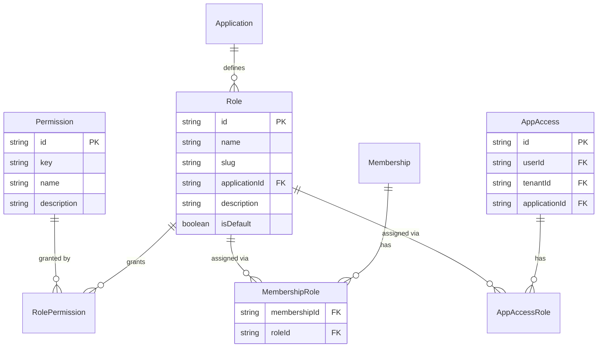

# Access Control (RBAC)

> Role-based access control with fine-grained permissions.

## Overview

AuthVital implements a flexible **Role-Based Access Control (RBAC)** system with:

- **Tenant Roles**: Built-in roles for tenant management (Owner, Admin, Member)
- **Application Roles**: Custom roles per application with permissions
- **Permissions**: Fine-grained access control strings
- **App Access**: Control which users can access which applications

## Role Hierarchy

```
┌─────────────────────────────────────────────────────────────────────────────┐
│                            AuthVital RBAC System                             │
├─────────────────────────────────────────────────────────────────────────────┤
│                                                                              │
│  TENANT LEVEL                          APPLICATION LEVEL                     │
│  ─────────────                         ─────────────────                     │
│                                                                              │
│  ┌──────────┐                          ┌──────────────┐                     │
│  │  Owner   │ ─ Full tenant control    │  App Admin   │ ─ Full app access   │
│  └────┬─────┘                          └──────┬───────┘                     │
│       │                                       │                              │
│  ┌────▼─────┐                          ┌──────▼───────┐                     │
│  │  Admin   │ ─ Manage members/roles   │  Manager     │ ─ Create/edit       │
│  └────┬─────┘                          └──────┬───────┘                     │
│       │                                       │                              │
│  ┌────▼─────┐                          ┌──────▼───────┐                     │
│  │  Member  │ ─ Basic access           │  Viewer      │ ─ Read-only         │
│  └──────────┘                          └──────────────┘                     │
│                                                                              │
└─────────────────────────────────────────────────────────────────────────────┘
```

## Tenant Roles

Built-in roles that control tenant-level permissions:

| Role | Permissions |
|------|-------------|
| **Owner** | Full access, delete tenant, manage billing, transfer ownership |
| **Admin** | Manage members, roles, SSO, settings (except delete/billing) |
| **Member** | Basic access to tenant resources |

### Default Tenant Roles

These are created automatically for each tenant:

```typescript
const DEFAULT_TENANT_ROLES = [
  {
    slug: 'owner',
    name: 'Owner',
    description: 'Full access to tenant',
    isDefault: false,
    permissions: ['tenant:*'],
  },
  {
    slug: 'admin',
    name: 'Admin',
    description: 'Manage members and settings',
    isDefault: false,
    permissions: [
      'tenant:read',
      'tenant:members:*',
      'tenant:settings:*',
      'tenant:sso:*',
    ],
  },
  {
    slug: 'member',
    name: 'Member',
    description: 'Basic tenant access',
    isDefault: true, // Assigned to new members
    permissions: ['tenant:read'],
  },
];
```

## Application Roles

Custom roles defined per application:

```typescript
// Example: Project Management App roles
const appRoles = [
  {
    slug: 'admin',
    name: 'Administrator',
    description: 'Full application access',
    permissions: [
      'projects:*',
      'users:*',
      'settings:*',
      'billing:*',
    ],
  },
  {
    slug: 'manager',
    name: 'Project Manager',
    description: 'Create and manage projects',
    permissions: [
      'projects:create',
      'projects:read',
      'projects:update',
      'projects:delete',
      'projects:members:*',
      'users:read',
    ],
  },
  {
    slug: 'member',
    name: 'Team Member',
    description: 'Work on assigned projects',
    permissions: [
      'projects:read',
      'projects:tasks:*',
      'users:read',
    ],
  },
  {
    slug: 'viewer',
    name: 'Viewer',
    description: 'Read-only access',
    permissions: [
      'projects:read',
      'users:read',
    ],
  },
];
```

## Permissions

### Format

Permissions use a `resource:action` format:

```
resource:action
resource:sub-resource:action
resource:*              (all actions)
*                       (superadmin - all permissions)
```

### Examples

```typescript
// Common permission patterns
const permissions = [
  // Basic CRUD
  'users:read',
  'users:create',
  'users:update',
  'users:delete',
  
  // Nested resources
  'projects:tasks:create',
  'projects:tasks:delete',
  'projects:members:invite',
  'projects:members:remove',
  
  // Wildcards
  'projects:*',          // All project actions
  'billing:*',           // All billing actions
  'settings:*',          // All settings actions
  
  // Admin-level
  '*',                   // Superadmin - all permissions
];
```

### Permission Inheritance

Wildcards include all sub-permissions:

```
projects:* includes:
  - projects:read
  - projects:create
  - projects:update
  - projects:delete
  - projects:tasks:*
  - projects:members:*
```

## Data Model



## App Access

Control which users can access which applications:

### Access Modes

| Mode | Description |
|------|-------------|
| `AUTOMATIC` | All tenant members automatically get access |
| `MANUAL_AUTO_GRANT` | Manual control, but new members get access by default |
| `MANUAL_NO_DEFAULT` | Manual control, new members must be explicitly granted |
| `DISABLED` | No new access grants (existing access preserved) |

### Managing Access

```typescript
// Grant access to user
await authvital.appAccess.grant({
  userId: 'user-id',
  tenantId: 'tenant-id',
  applicationId: 'app-id',
  roleIds: ['role-admin'], // Optional: assign roles
});

// Revoke access
await authvital.appAccess.revoke({
  userId: 'user-id',
  tenantId: 'tenant-id',
  applicationId: 'app-id',
});

// Update roles
await authvital.appAccess.updateRoles({
  userId: 'user-id',
  tenantId: 'tenant-id',
  applicationId: 'app-id',
  roleIds: ['role-manager'],
});
```

## SDK Usage

### Check Permission

```typescript
// Server-side
const { allowed } = await authvital.permissions.check(req, {
  permission: 'projects:delete',
});

if (!allowed) {
  return res.status(403).json({ error: 'Forbidden' });
}
```

### Check Multiple Permissions

```typescript
// Check ALL permissions (must have all)
const { allowed } = await authvital.permissions.checkAll(req, {
  permissions: ['projects:read', 'projects:update'],
});

// Check ANY permission (must have at least one)
const { allowed } = await authvital.permissions.checkAny(req, {
  permissions: ['projects:delete', 'admin:*'],
});

// Get individual results
const results = await authvital.permissions.checkMany(req, {
  permissions: ['projects:read', 'projects:write', 'admin:*'],
});
// { 'projects:read': true, 'projects:write': true, 'admin:*': false }
```

### Check Role

```typescript
// From JWT claims
const hasRole = user.app_roles.includes('admin');

// Check any of multiple roles
const isAdminOrManager = ['admin', 'manager'].some(
  role => user.app_roles.includes(role)
);
```

## Middleware Examples

### Express Permission Middleware

```typescript
function requirePermission(...permissions: string[]) {
  return async (req, res, next) => {
    const { allowed } = await authvital.permissions.checkAll(req, {
      permissions,
    });
    
    if (!allowed) {
      return res.status(403).json({
        error: 'Forbidden',
        required: permissions,
        message: 'You do not have permission to perform this action',
      });
    }
    
    next();
  };
}

// Usage
app.delete('/api/projects/:id',
  requireAuth,
  requirePermission('projects:delete'),
  deleteProjectHandler
);
```

### NestJS Permission Guard

```typescript
// decorator
export const RequirePermissions = (...permissions: string[]) =>
  SetMetadata('permissions', permissions);

// guard
@Injectable()
export class PermissionGuard implements CanActivate {
  constructor(private reflector: Reflector) {}

  canActivate(context: ExecutionContext): boolean {
    const required = this.reflector.get<string[]>(
      'permissions',
      context.getHandler()
    );
    
    if (!required?.length) return true;
    
    const { user } = context.switchToHttp().getRequest();
    const userPerms = user.app_permissions || [];
    
    return required.every(perm => 
      userPerms.includes(perm) || 
      userPerms.includes('*') ||
      userPerms.includes(perm.split(':')[0] + ':*')
    );
  }
}

// usage
@Delete(':id')
@RequirePermissions('projects:delete')
async deleteProject(@Param('id') id: string) {
  // ...
}
```

## React Integration

### Permission Component

```tsx
function HasPermission({ 
  permission, 
  children, 
  fallback = null 
}: {
  permission: string | string[];
  children: React.ReactNode;
  fallback?: React.ReactNode;
}) {
  const { user } = useAuthVital();
  
  const permissions = Array.isArray(permission) ? permission : [permission];
  const userPerms = user?.app_permissions || [];
  
  const hasPermission = permissions.every(perm => 
    userPerms.includes(perm) ||
    userPerms.includes('*') ||
    userPerms.includes(perm.split(':')[0] + ':*')
  );
  
  return hasPermission ? <>{children}</> : <>{fallback}</>;
}

// Usage
<HasPermission 
  permission="users:delete"
  fallback={<span>Not authorized</span>}
>
  <DeleteUserButton />
</HasPermission>
```

### Role Component

```tsx
function HasRole({ 
  role, 
  children,
  fallback = null
}: {
  role: string | string[];
  children: React.ReactNode;
  fallback?: React.ReactNode;
}) {
  const { user } = useAuthVital();
  
  const roles = Array.isArray(role) ? role : [role];
  const hasRole = roles.some(r => user?.app_roles?.includes(r));
  
  return hasRole ? <>{children}</> : <>{fallback}</>;
}

// Usage
<HasRole role={['admin', 'manager']}>
  <AdminPanel />
</HasRole>
```

### usePermissions Hook

```tsx
function usePermissions() {
  const { user } = useAuthVital();
  const userPerms = user?.app_permissions || [];
  
  const can = useCallback((permission: string) => {
    return userPerms.includes(permission) ||
           userPerms.includes('*') ||
           userPerms.includes(permission.split(':')[0] + ':*');
  }, [userPerms]);
  
  const canAll = useCallback((permissions: string[]) => {
    return permissions.every(can);
  }, [can]);
  
  const canAny = useCallback((permissions: string[]) => {
    return permissions.some(can);
  }, [can]);
  
  return { can, canAll, canAny, permissions: userPerms };
}

// Usage
function ProjectActions({ projectId }) {
  const { can } = usePermissions();
  
  return (
    <div>
      {can('projects:update') && <EditButton />}
      {can('projects:delete') && <DeleteButton />}
      {can('projects:members:invite') && <InviteButton />}
    </div>
  );
}
```

## Admin: Managing Roles

### Create Custom Role

```typescript
await authvital.roles.create({
  applicationId: 'app-id',
  name: 'Quality Assurance',
  slug: 'qa',
  description: 'Test and verify projects',
  permissions: [
    'projects:read',
    'projects:tasks:read',
    'projects:tasks:update',
    'reports:read',
  ],
  isDefault: false,
});
```

### Update Role Permissions

```typescript
await authvital.roles.update('role-id', {
  permissions: [
    'projects:read',
    'projects:tasks:*', // Upgraded: full task access
    'reports:*',        // Added: full reports access
  ],
});
```

### Assign Role to User

```typescript
// Via membership (tenant role)
await authvital.memberships.setTenantRole({
  membershipId: 'membership-id',
  roleSlug: 'admin',
});

// Via app access (application role)
await authvital.appAccess.updateRoles({
  userId: 'user-id',
  tenantId: 'tenant-id',
  applicationId: 'app-id',
  roleIds: ['role-qa', 'role-member'],
});
```

## JWT Claims

Roles and permissions are included in the JWT:

```json
{
  "sub": "user-id",
  "tenant_id": "tenant-id",
  "tenant_role": "admin",
  "app_roles": ["manager", "member"],
  "app_permissions": [
    "projects:create",
    "projects:read",
    "projects:update",
    "projects:members:*",
    "users:read"
  ]
}
```

## Best Practices

### ✅ Do

1. **Use descriptive permission names** - `projects:tasks:create` > `pt:c`
2. **Group by resource** - `projects:*`, `users:*`
3. **Least privilege** - Grant minimum permissions needed
4. **Audit role changes** - Log who changed what
5. **Test permissions** - Include in integration tests

### ❌ Don't

1. **Don't use `*` liberally** - Reserved for true superadmins
2. **Don't hardcode roles** - Use permissions instead
3. **Don't skip server validation** - UI checks are not enough
4. **Don't forget default roles** - New users need baseline access

---

## Related Documentation

- [Multi-Tenancy](./multi-tenancy.md)
- [Licensing System](./licensing.md)
- [Server SDK](../sdk/server-sdk.md)
- [JWT Claims](../reference/jwt-claims.md)
