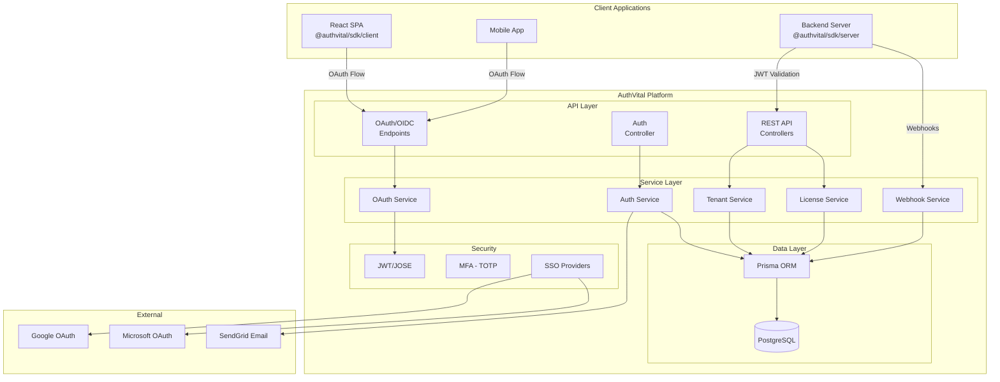
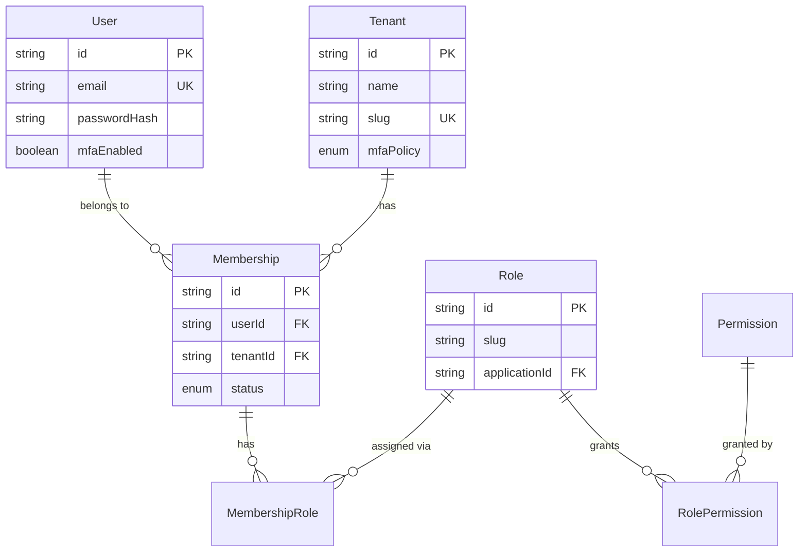
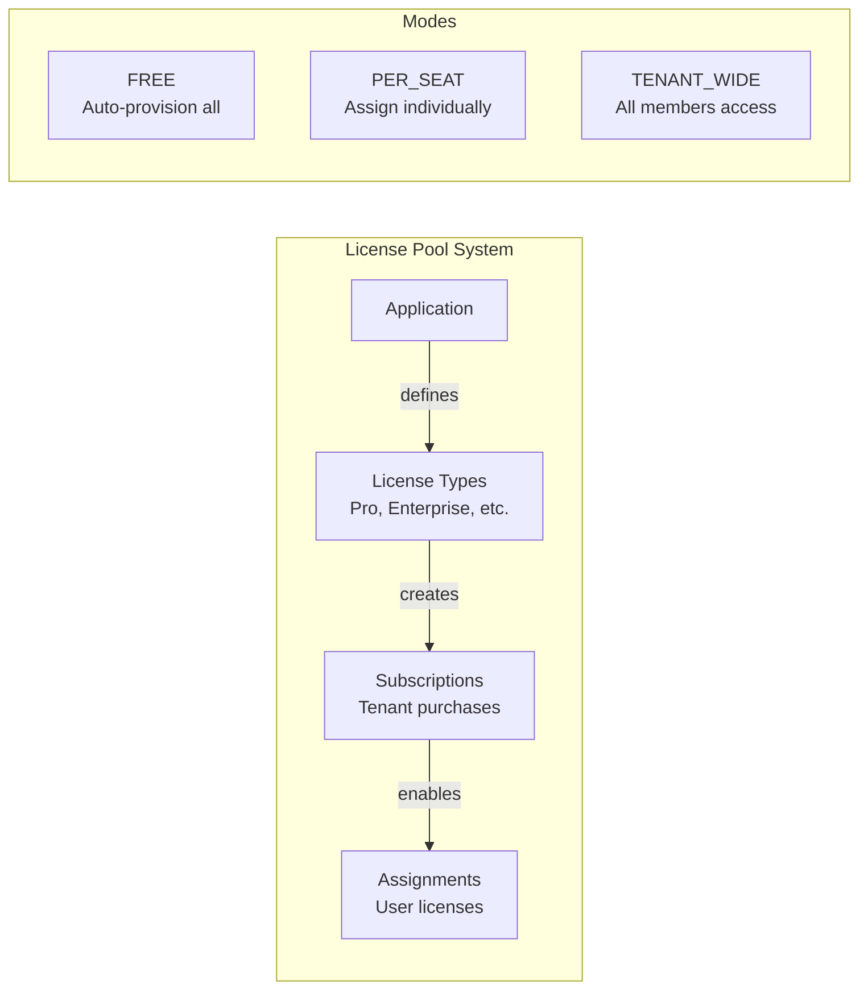
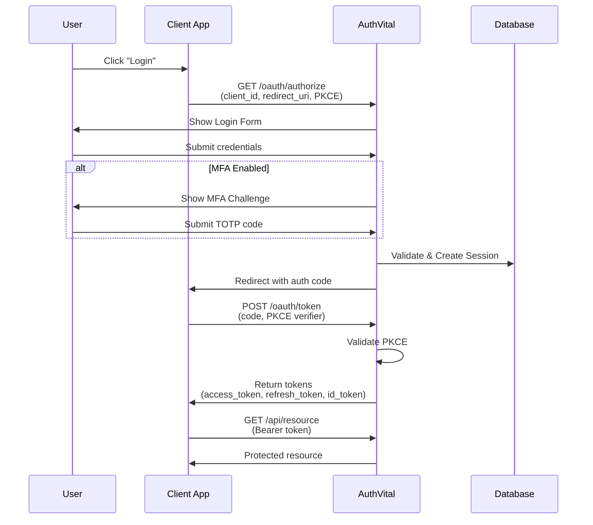
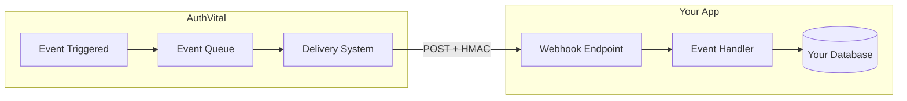
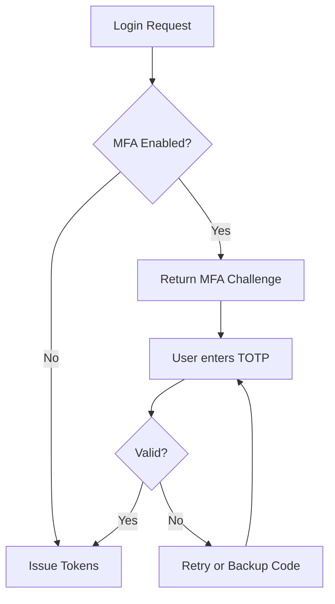

# Architecture Overview

> Understanding AuthVital's system design and how components interact.

## System Overview

AuthVital is a **B2B Identity Provider** built as a multi-tenant OAuth 2.0/OIDC compliant authentication platform. It provides:

- **Authentication**: OAuth 2.0 with PKCE, password login, SSO
- **Authorization**: Role-based access control (RBAC) with permissions
- **Multi-tenancy**: Complete tenant isolation with membership management
- **Licensing**: Flexible license pool system for SaaS applications
- **Extensibility**: Webhooks and SDK for seamless integration

## High-Level Architecture



## Core Components

### 1. OAuth/OIDC Server

The heart of AuthVital - a fully compliant OAuth 2.0 and OpenID Connect server.

| Endpoint | Purpose |
|----------|--------|
| `GET /oauth/authorize` | Start authorization flow |
| `POST /oauth/token` | Exchange code for tokens |
| `GET /oauth/userinfo` | Get user profile (OIDC) |
| `GET /.well-known/openid-configuration` | OIDC discovery |
| `GET /.well-known/jwks.json` | Public signing keys |

**Key Features:**
- PKCE (Proof Key for Code Exchange) for SPAs
- Refresh token rotation
- Tenant-scoped tokens
- Automatic key rotation

### 2. Multi-Tenant Data Model



### 3. Licensing Engine

AuthVital includes a sophisticated license pool system for SaaS applications:



**Licensing Modes:**

| Mode | Description | Use Case |
|------|-------------|----------|
| `FREE` | All users get access automatically | Free tier, open products |
| `PER_SEAT` | Each user needs an assigned seat | Traditional SaaS licensing |
| `TENANT_WIDE` | Tenant subscribes, all members access | Team/org subscriptions |

### 4. Authentication Flow



### 5. Webhook System

Real-time event notifications for integrating with your systems:



**Event Categories:**
- `subject.*` - User lifecycle (created, updated, deleted)
- `member.*` - Membership changes (joined, left, role_changed)
- `invite.*` - Invitation lifecycle
- `license.*` - License assignments
- `app_access.*` - Application access changes

## Directory Structure

```
authvital/
├── backend/                    # NestJS API Server
│   ├── src/
│   │   ├── auth/              # Authentication (login, register, MFA)
│   │   ├── oauth/             # OAuth 2.0/OIDC endpoints
│   │   ├── tenants/           # Tenant & membership management
│   │   ├── licensing/         # License pool system
│   │   ├── authorization/     # RBAC engine
│   │   ├── sso/               # SSO providers (Google, Microsoft)
│   │   ├── webhooks/          # System webhook delivery
│   │   ├── super-admin/       # Instance administration
│   │   └── prisma/            # Database service
│   ├── prisma/
│   │   ├── schema.prisma      # Data model (53KB!)
│   │   └── migrations/        # Database migrations
│   └── sdk/                   # @authvital/sdk package
│       └── src/
│           ├── client/        # React SDK
│           ├── server/        # Node.js SDK
│           ├── sync/          # User sync utilities
│           └── webhooks/      # Webhook handlers
├── frontend/                  # React Admin Panel
│   └── src/
│       ├── pages/
│       │   ├── admin/         # Super admin UI
│       │   ├── auth/          # Auth flows UI
│       │   └── tenant/        # Tenant admin UI
│       └── components/
└── docker-compose.yml         # Local development
```

## Security Architecture

### Token Security

| Token Type | Lifetime | Storage | Purpose |
|------------|----------|---------|--------|
| Access Token | 1 hour | Memory | API authorization |
| Refresh Token | 7 days | HttpOnly cookie | Token renewal |
| ID Token | 1 hour | Memory | User identity (OIDC) |
| Auth Code | 10 min | Server only | OAuth exchange |

### Key Management

- **Signing Keys**: Ed25519 for JWT signatures
- **Automatic Rotation**: Keys rotate every 7 days
- **JWKS Endpoint**: Public keys available at `/.well-known/jwks.json`
- **Key Encryption**: Sensitive data encrypted at rest

### MFA Implementation



## Scalability Considerations

### Stateless Design

- JWT tokens are self-contained (no session lookup)
- Horizontal scaling supported
- Database is the only stateful component

### Caching Points

| Data | Cache Strategy |
|------|---------------|
| JWKS | Client-side caching (Cache-Control) |
| User Sessions | Database with indexes |
| Tenant Config | Application-level cache |

### Database Indexes

Key indexes for performance:
- `users.email` - Login lookups
- `sessions.token` - Session validation
- `refresh_tokens.id` - Token ghosting
- `memberships(user_id, tenant_id)` - Membership checks

## Integration Patterns

### Pattern 1: Full SDK Integration

Best for new applications:

```
┌─────────────┐     ┌─────────────┐     ┌─────────────┐
│ React App   │────▶│ Your API    │────▶│ AuthVital   │
│ (SDK/Client)│     │ (SDK/Server)│     │             │
└─────────────┘     └─────────────┘     └─────────────┘
```

### Pattern 2: Direct OAuth

For custom implementations:

```
┌─────────────┐     ┌─────────────┐
│ Any Client  │────▶│ AuthVital   │
│ (OAuth lib) │     │ OAuth API   │
└─────────────┘     └─────────────┘
```

### Pattern 3: Webhook Sync

For keeping local user data:

```
┌─────────────┐     ┌─────────────┐     ┌─────────────┐
│ AuthVital   │────▶│ Your API    │────▶│ Your DB     │
│ (Webhooks)  │     │ (Handler)   │     │ (Users)     │
└─────────────┘     └─────────────┘     └─────────────┘
```

---

## Next Steps

- [Multi-Tenancy Deep Dive](./multi-tenancy.md)
- [OAuth Flow Details](./oauth-flow.md)
- [Licensing System](./licensing.md)
- [SDK Integration](../sdk/server-sdk/index.md)
