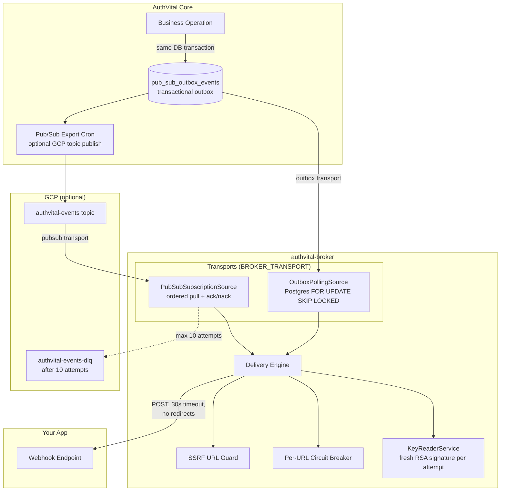

# Event Broker

> How AuthVital delivers webhooks: the transactional outbox, the
> authvital-broker service, and the two delivery modes.

## Overview

Every significant event (sync events for applications, system webhooks for
orchestration) is written to a **transactional outbox** table
(`pub_sub_outbox_events`) in the same database transaction as the business
change — the event exists if and only if the change committed.

Who delivers those events to your webhook endpoints depends on
`WEBHOOK_DELIVERY_MODE`:

- **`legacy` (default)** — the core delivers webhooks in-process, exactly as
  AuthVital always has. Zero configuration; right choice for
  single-container self-hosting.
- **`broker`** — the core only writes events; the separate
  **authvital-broker** service (`packages/broker`) owns all delivery,
  retries, and failure tracking.

## Architecture

## Transports

The broker consumes events through one of two interchangeable transports
(`BROKER_TRANSPORT`):

| | `outbox` (default) | `pubsub` |
|---|---|---|
| Infrastructure | PostgreSQL only — ideal for self-hosting | GCP Pub/Sub subscription |
| Mechanism | Polls `PENDING` rows with `FOR UPDATE SKIP LOCKED` (multi-replica safe), batch 100, every `BROKER_POLL_INTERVAL_MS` (5s) | Ordered streaming pull from `BROKER_PUBSUB_SUBSCRIPTION` |
| Retry scheduling | Backoff ladder written to the row: 10s, 30s, 1m, 5m, 15m, 1h, 4h, 12h, 24h, 48h — max 10 attempts, then `delivery_status = FAILED` | Pub/Sub redelivery; after `maxDeliveryAttempts` (10) the message parks in the `authvital-events-dlq` dead-letter topic |
| Terminal failure | `FAILED` row retained indefinitely (visible in the admin outbox dashboard) | DLQ message + broker writes `delivery_status = FAILED` back to the row |

## Delivery engine

Every attempt, regardless of transport:

1. **SSRF guard** — the target URL's scheme must be http(s) and its resolved
   addresses must not be private/loopback/link-local/metadata ranges
   (production default; `BROKER_ALLOW_PRIVATE_WEBHOOK_TARGETS=true` opts out
   for dev). Redirects are **never followed** — a 3xx response counts as a
   failed attempt, so a public URL cannot bounce the broker into a private
   address.
2. **Circuit breaker** — after 5 consecutive failures
   (`BROKER_CIRCUIT_FAILURE_THRESHOLD`) for a URL, deliveries to it
   short-circuit for 60s (`BROKER_CIRCUIT_COOLDOWN_MS`), protecting the
   worker from hammering a dead receiver.
3. **Fresh signature per attempt** — receivers enforce a ~300s replay window
   on `timestamp.body`, so retried deliveries are re-signed with a fresh
   timestamp using the **webhook-purpose** RSA key (RS256). The public key is
   published in the core's JWKS; receivers resolve by `kid` as always.
4. **Write-back** — sync-event deliveries update the `syncEvent` row
   (`webhookStatus`, attempts, errors) with the same semantics the in-core
   path used, so dashboards behave identically in both modes.

## Failed events and replay

- `delivery_status = FAILED` rows (and publish-`FAILED` rows) are **retained
  indefinitely** and visible via the admin Pub/Sub dashboard; the daily
  cleanup cron only removes rows that are both published/consumed **and**
  terminally delivered (`DELIVERED`/`SKIPPED`) after 7 days.
- Replay is manual by design: reset `delivery_status` to `PENDING` (outbox
  transport picks it up next poll) or re-publish the DLQ message. A one-click
  replay UI is future work.

## Configuration matrix

| Core `WEBHOOK_DELIVERY_MODE` | Broker running? | Result |
|---|---|---|
| `legacy` (default) | no | Classic in-core delivery: immediate attempt + 5-attempt retry cron (1m/5m/15m/1h/4h). |
| `broker` | yes (`outbox` or `pubsub`) | Core writes events atomically; broker delivers with the 10-attempt ladder + DLQ. |
| `broker` | no | Events accumulate as `PENDING` — nothing is lost, delivery resumes when the broker starts. |
| `legacy` | yes | **DOUBLE DELIVERY.** The core delivers immediately AND the broker consumes the same outbox rows. The broker logs a boot warning because it cannot detect the core's mode (it is env-only, never persisted). Don't do this. |

## Deployment topologies

- **Single container (default)**: `SERVICE_ROLE=all` + `legacy` delivery —
  nothing to configure, no broker needed.
- **Split** (see [Service Roles](./service-roles.md)): public + admin +
  broker services, `WEBHOOK_DELIVERY_MODE=broker` on both app services.
  Locally: `docker compose --profile split up`. On GCP:
  `./scripts/deploy-gcp.sh --split` (creates the topic, DLQ topic, and
  ordered subscription with `maxDeliveryAttempts=10`).

## Broker environment reference

| Variable | Default | Purpose |
|---|---|---|
| `BROKER_TRANSPORT` | `outbox` | `outbox` (Postgres polling) or `pubsub` (GCP subscription) |
| `BROKER_PORT` | `8100` | HTTP port for `/health` |
| `BROKER_POLL_INTERVAL_MS` | `5000` | Outbox poll interval |
| `BROKER_PUBSUB_SUBSCRIPTION` | — | Subscription name (pubsub transport) |
| `BROKER_ALLOW_PRIVATE_WEBHOOK_TARGETS` | prod: `false`, dev: `true` | SSRF guard opt-out |
| `BROKER_CIRCUIT_FAILURE_THRESHOLD` | `5` | Consecutive failures before a URL's circuit opens |
| `BROKER_CIRCUIT_COOLDOWN_MS` | `60000` | Circuit open duration |
| `MASTER_SECRET` | — | Same secret as core — decrypts the webhook signing key |
| `DATABASE_URL` (or `DB_*` parts) | — | Same database as core |

`/health` returns 200 only while the transport is actually consuming
(503 during startup/shutdown), so orchestrators never route work to a
non-draining broker.

---

## Next Steps

- [Service Roles & Split Deployment](./service-roles.md)
- [Webhooks SDK Guide](../sdk/webhooks.md)
- [GCP Pub/Sub Integration](../sdk/pubsub.md)
