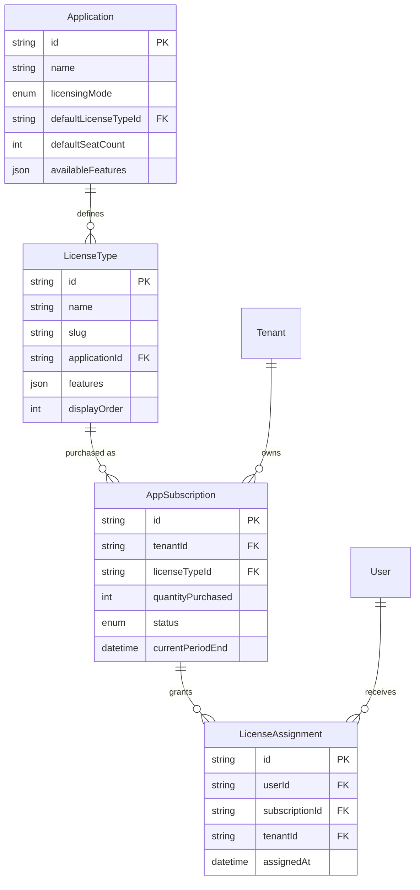

# Licensing System

> AuthVader's flexible license pool system for SaaS monetization.

## Overview

AuthVader includes a sophisticated **license pool system** that enables:

- Per-seat licensing (assign licenses to individual users)
- Tenant-wide access (whole organization gets access)
- Free tiers with automatic provisioning
- Feature flags tied to license types
- Subscription management with seat counts

## Licensing Modes

Each application can be configured with one of three licensing modes:

| Mode | Description | Use Case |
|------|-------------|----------|
| `FREE` | All users automatically get access | Free products, open-source tools |
| `PER_SEAT` | Each user needs an assigned license seat | Traditional SaaS (Slack, Jira) |
| `TENANT_WIDE` | Tenant subscribes, all members get access | Team plans (Notion, Figma) |

### FREE Mode

```
┌─────────────────────────────────────────────┐
│                 Application                  │
│            licensingMode: FREE               │
├─────────────────────────────────────────────┤
│  User joins tenant → Automatic access ✓     │
│  No seat limits                              │
│  No subscription required                    │
└─────────────────────────────────────────────┘
```

**Configuration:**
```typescript
// Application settings
{
  licensingMode: 'FREE',
  autoProvisionOnSignup: true, // Automatically grant access
}
```

### PER_SEAT Mode

```
┌─────────────────────────────────────────────┐
│               Tenant: Acme Corp              │
├─────────────────────────────────────────────┤
│  Subscription: Pro Plan (10 seats)          │
│  ├─ Seat 1: alice@acme.com ✓                │
│  ├─ Seat 2: bob@acme.com ✓                  │
│  ├─ Seat 3: carol@acme.com ✓                │
│  ├─ Seats 4-10: Available                   │
│  └─ dave@acme.com: No seat (access denied)  │
└─────────────────────────────────────────────┘
```

**Configuration:**
```typescript
{
  licensingMode: 'PER_SEAT',
  autoProvisionOnSignup: true,  // Create subscription on tenant signup
  defaultLicenseTypeId: 'license-type-pro',
  defaultSeatCount: 5,          // Initial seats
  autoGrantToOwner: true,       // Owner gets first seat automatically
}
```

### TENANT_WIDE Mode

```
┌─────────────────────────────────────────────┐
│               Tenant: Acme Corp              │
├─────────────────────────────────────────────┤
│  Subscription: Enterprise Plan              │
│  All 50 members have access ✓               │
│  No individual seat assignments             │
└─────────────────────────────────────────────┘
```

**Configuration:**
```typescript
{
  licensingMode: 'TENANT_WIDE',
  autoProvisionOnSignup: true,
  defaultLicenseTypeId: 'license-type-enterprise',
}
```

## Data Model



## License Types

License types define tiers within an application:

```typescript
interface LicenseType {
  id: string;
  name: string;           // "Pro Plan"
  slug: string;           // "pro"
  description: string;
  applicationId: string;
  features: Record<string, boolean>;  // Feature flags
  displayOrder: number;   // For UI ordering
}

// Example license types
const licenseTypes = [
  {
    name: 'Free',
    slug: 'free',
    features: {
      'basic-reports': true,
      'api-access': false,
      'sso': false,
    },
  },
  {
    name: 'Pro',
    slug: 'pro',
    features: {
      'basic-reports': true,
      'advanced-reports': true,
      'api-access': true,
      'sso': false,
    },
  },
  {
    name: 'Enterprise',
    slug: 'enterprise',
    features: {
      'basic-reports': true,
      'advanced-reports': true,
      'api-access': true,
      'sso': true,
      'audit-logs': true,
      'custom-branding': true,
    },
  },
];
```

## Subscriptions

A subscription represents a tenant's purchase of license seats:

```typescript
interface AppSubscription {
  id: string;
  tenantId: string;
  applicationId: string;
  licenseTypeId: string;
  quantityPurchased: number;  // Total seats purchased
  quantityAssigned: number;   // Seats currently assigned (computed)
  quantityAvailable: number;  // Seats remaining (computed)
  status: 'ACTIVE' | 'TRIALING' | 'PAST_DUE' | 'CANCELED' | 'EXPIRED';
  currentPeriodEnd: Date;     // When subscription renews/expires
}
```

### Subscription Status

| Status | Description |
|--------|-------------|
| `ACTIVE` | Subscription is current and paid |
| `TRIALING` | In trial period |
| `PAST_DUE` | Payment failed, grace period |
| `CANCELED` | Canceled but not yet expired |
| `EXPIRED` | No longer valid |

## Feature Flags

Features are boolean flags tied to license types:

```typescript
// Define available features in application settings
const availableFeatures = [
  { key: 'api-access', name: 'API Access', description: 'REST API access' },
  { key: 'sso', name: 'Single Sign-On', description: 'SAML/OIDC SSO' },
  { key: 'advanced-reports', name: 'Advanced Reports', description: 'Custom dashboards' },
  { key: 'audit-logs', name: 'Audit Logs', description: 'Activity tracking' },
];

// Check feature in your app
const { hasFeature } = await authvader.licenses.hasFeature(req, {
  applicationId: 'app-123',
  feature: 'advanced-reports',
});

if (!hasFeature) {
  return res.status(402).json({
    error: 'Feature not available',
    feature: 'advanced-reports',
    upgradeUrl: '/pricing',
  });
}
```

## JWT Claims

License information is included in the JWT:

```json
{
  "sub": "user-123",
  "email": "user@acme.com",
  "tenant_id": "tenant-456",
  
  "license": {
    "type": "pro",
    "name": "Pro Plan",
    "features": ["basic-reports", "advanced-reports", "api-access"]
  }
}
```

Access in your code:

```typescript
const { user } = await authvader.getCurrentUser(req);

// Check license type
if (user.license?.type === 'enterprise') {
  // Premium features
}

// Check specific feature
if (user.license?.features.includes('sso')) {
  // SSO enabled
}
```

## SDK Methods

### Check License

```typescript
// Check if user has any license
const { hasLicense, licenseType, features } = await authvader.licenses.check(req, {
  applicationId: 'app-123',
});

console.log(hasLicense);    // true
console.log(licenseType);   // "pro"
console.log(features);      // ["basic-reports", "api-access"]
```

### Check Feature

```typescript
const { hasFeature } = await authvader.licenses.hasFeature(req, {
  applicationId: 'app-123',
  feature: 'advanced-reports',
});
```

### Get Full License Details

```typescript
const license = await authvader.licenses.getUserLicense(req, {
  applicationId: 'app-123',
});
// {
//   type: "pro",
//   typeId: "lt-123",
//   name: "Pro Plan",
//   features: ["basic-reports", "api-access"],
//   assignedAt: "2024-01-15T...",
//   subscription: {
//     id: "sub-456",
//     status: "ACTIVE",
//     currentPeriodEnd: "2024-02-15T..."
//   }
// }
```

### Admin: Grant License

```typescript
await authvader.licenses.grant(req, {
  userId: 'user-123',
  applicationId: 'app-123',
  licenseTypeId: 'lt-pro',
  tenantId: 'tenant-456',
});
```

### Admin: Revoke License

```typescript
await authvader.licenses.revoke(req, {
  userId: 'user-123',
  applicationId: 'app-123',
  tenantId: 'tenant-456',
});
```

### Get Tenant License Overview

```typescript
const overview = await authvader.licenses.getTenantOverview(req, {
  tenantId: 'tenant-456',
});
// {
//   tenantId: "tenant-456",
//   subscriptions: [
//     {
//       id: "sub-1",
//       applicationName: "Project Manager",
//       licenseTypeName: "Pro Plan",
//       quantityPurchased: 10,
//       quantityAssigned: 7,
//       quantityAvailable: 3,
//       status: "ACTIVE",
//       features: { "api-access": true, "sso": false }
//     }
//   ],
//   totalSeatsOwned: 10,
//   totalSeatsAssigned: 7
// }
```

## Middleware Examples

### License Gate

```typescript
const requireLicense = (applicationId: string) => async (req, res, next) => {
  const { hasLicense } = await authvader.licenses.check(req, {
    applicationId,
  });
  
  if (!hasLicense) {
    return res.status(402).json({
      error: 'License required',
      message: 'Please purchase a license to access this feature',
      upgradeUrl: '/pricing',
    });
  }
  
  next();
};

// Usage
app.use('/api/premium', requireLicense('app-123'));
```

### Feature Gate

```typescript
const requireFeature = (applicationId: string, feature: string) => {
  return async (req, res, next) => {
    const { hasFeature } = await authvader.licenses.hasFeature(req, {
      applicationId,
      feature,
    });
    
    if (!hasFeature) {
      return res.status(402).json({
        error: 'Feature not available',
        feature,
        message: `Upgrade your plan to access ${feature}`,
        upgradeUrl: '/pricing',
      });
    }
    
    next();
  };
};

// Usage
app.get('/api/analytics', 
  requireAuth,
  requireFeature('app-123', 'advanced-analytics'),
  analyticsHandler
);
```

## React Integration

### License Context

```tsx
function PremiumFeature() {
  const { user } = useAuthVader();
  const hasFeature = user?.license?.features.includes('advanced-analytics');
  
  if (!hasFeature) {
    return (
      <div className="upgrade-prompt">
        <p>Upgrade to Pro to access Advanced Analytics</p>
        <a href="/pricing">View Plans</a>
      </div>
    );
  }
  
  return <AnalyticsDashboard />;
}
```

### Feature Flag Component

```tsx
function FeatureGate({ 
  feature, 
  children, 
  fallback 
}: { 
  feature: string;
  children: React.ReactNode;
  fallback?: React.ReactNode;
}) {
  const { user } = useAuthVader();
  const hasFeature = user?.license?.features.includes(feature);
  
  if (!hasFeature) {
    return fallback || null;
  }
  
  return <>{children}</>;
}

// Usage
<FeatureGate 
  feature="sso" 
  fallback={<UpgradePrompt feature="SSO" />}
>
  <SsoSettings />
</FeatureGate>
```

## Webhook Events

License changes trigger webhook events:

| Event | When |
|-------|------|
| `license.assigned` | User granted a license |
| `license.revoked` | User's license removed |
| `license.changed` | User's license type changed |

```typescript
class MyEventHandler extends AuthVaderEventHandler {
  async onLicenseAssigned(event) {
    const { sub, license_type_slug, features } = event.data;
    
    // Provision resources
    await provisionUserStorage(sub, {
      quota: features.includes('unlimited-storage') ? 'unlimited' : '10GB',
    });
    
    // Send upgrade email
    await sendEmail(event.data.email, 'upgrade-complete', {
      plan: license_type_slug,
    });
  }
  
  async onLicenseRevoked(event) {
    // Cleanup or downgrade
    await revokeApiKeys(event.data.sub);
  }
}
```

## Integration with Billing

AuthVader manages **license assignments**, not billing. Integrate with your billing system:

```
┌──────────────┐    Purchase    ┌──────────────┐    Update     ┌──────────────┐
│   Billing    │ ──────────────▶│   Your API   │ ─────────────▶│  AuthVader   │
│  (Stripe)    │                │              │               │              │
└──────────────┘                └──────────────┘               └──────────────┘
       │                               │                              │
       │ webhook                       │ create/update               │ stores
       └───────────────────────────────┘ subscription                │ assignments
                                                                     │
                                                              ┌──────────────┐
                                                              │  JWT claims  │
                                                              │  (license)   │
                                                              └──────────────┘
```

### Example: Stripe Webhook Handler

```typescript
app.post('/webhooks/stripe', async (req, res) => {
  const event = stripe.webhooks.constructEvent(req.body, sig, webhookSecret);
  
  switch (event.type) {
    case 'checkout.session.completed': {
      const session = event.data.object;
      
      // Create subscription in AuthVader
      await authvader.admin.createSubscription({
        tenantId: session.metadata.tenantId,
        applicationId: session.metadata.applicationId,
        licenseTypeId: session.metadata.licenseTypeId,
        quantityPurchased: session.metadata.seats,
        status: 'ACTIVE',
        currentPeriodEnd: new Date(session.current_period_end * 1000),
      });
      break;
    }
    
    case 'customer.subscription.updated': {
      const subscription = event.data.object;
      
      // Update seats in AuthVader
      await authvader.admin.updateSubscription(
        subscription.metadata.authvaderSubscriptionId,
        {
          quantityPurchased: subscription.items.data[0].quantity,
          status: subscription.status.toUpperCase(),
        }
      );
      break;
    }
  }
  
  res.json({ received: true });
});
```

## Best Practices

### 1. Cache License Checks

For performance, cache JWT claims (they're self-contained):

```typescript
// License info is in the JWT - no API call needed!
const { user } = await authvader.getCurrentUser(req);
const hasFeature = user.license?.features.includes('advanced-reports');
```

### 2. Handle Grace Periods

Allow access during payment failures:

```typescript
const subscription = await authvader.licenses.getSubscription(req, {
  applicationId: 'app-123',
});

if (subscription.status === 'PAST_DUE') {
  // Show warning but allow access
  res.set('X-License-Warning', 'Payment past due');
}
```

### 3. Provide Upgrade Paths

Always show users how to upgrade:

```typescript
if (!hasFeature) {
  return res.status(402).json({
    error: 'Feature requires upgrade',
    currentPlan: user.license?.type || 'free',
    requiredPlan: 'pro',
    upgradeUrl: `/pricing?current=${user.license?.type}`,
  });
}
```

---

## Related Documentation

- [Access Control (RBAC)](./access-control.md)
- [Multi-Tenancy](./multi-tenancy.md)
- [Server SDK](../sdk/server-sdk.md)
- [Webhooks](../sdk/webhooks.md)
