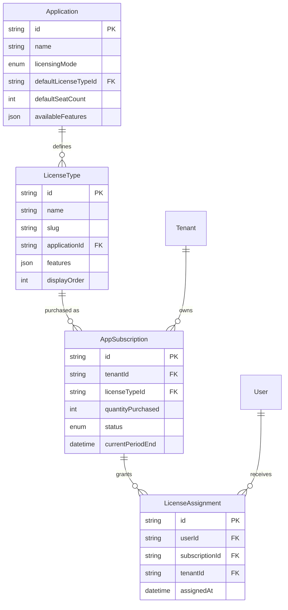

# Licensing System

> AuthVital's flexible license pool system for SaaS monetization.

!!! warning "Code samples: the `authvital.licenses.*` / `authvital.admin.*` API is not real"
    The concepts on this page are accurate, but the SDK snippets use a fluent
    request-scoped API (`authvital.licenses.check`, `authvital.licenses.grant`,
    `authvital.admin.createSubscription`, `authvital.getCurrentUser`) that **does
    not exist**. Map them to the real API:

    - `authvital.licenses.check` -> `createServerClient(...).checkLicense({ userId, applicationId })` (a `ServerClient` method on the **user token**; `tenantId` comes from the JWT — **not** `client.integration.*`)
    - `authvital.licenses.hasFeature` -> `client.checkLicenseFeature({ userId, applicationId, featureKey })` (also a `ServerClient` user-token read)
    - `authvital.licenses.grant` / `revoke` -> `client.integration.grantLicense(...)` / `revokeLicense(...)`
    - `authvital.licenses.getTenantOverview` -> `client.integration.getUsageOverview({ tenantId })`
    - `authvital.getCurrentUser` -> read claims via `verifyToken(...)` (the `license` claim carries type/name/features)
    - Subscription create/update (`authvital.admin.*Subscription`) is **not** in the SDK — use the REST endpoints `/api/tenants/:tenantId/licenses/subscriptions*`.

    See [Licensing API](../api/licensing-api.md) and the
    [Licenses namespace](../sdk/server-sdk/namespaces/licenses.md).

## Overview

AuthVital includes a sophisticated **license pool system** that enables:

- Per-seat licensing (assign licenses to individual users)
- Tenant-wide access (whole organization gets access)
- Free tiers with automatic provisioning
- Feature flags tied to license types
- Subscription management with seat counts

## Licensing Modes

Each application can be configured with one of three licensing modes:

| Mode | Description | Use Case |
|------|-------------|----------|
| `FREE` | All users automatically get access | Free products, open-source tools |
| `PER_SEAT` | Each user needs an assigned license seat | Traditional SaaS (Slack, Jira) |
| `TENANT_WIDE` | Tenant subscribes, all members get access | Team plans (Notion, Figma) |

### FREE Mode

```
┌─────────────────────────────────────────────┐
│                 Application                  │
│            licensingMode: FREE               │
├─────────────────────────────────────────────┤
│  User joins tenant → Automatic access ✓     │
│  No seat limits                              │
│  No subscription required                    │
└─────────────────────────────────────────────┘
```

**Configuration:**
```typescript
// Application settings
{
  licensingMode: 'FREE',
  autoProvisionOnSignup: true, // Automatically grant access
}
```

### PER_SEAT Mode

```
┌─────────────────────────────────────────────┐
│               Tenant: Acme Corp              │
├─────────────────────────────────────────────┤
│  Subscription: Pro Plan (10 seats)          │
│  ├─ Seat 1: alice@acme.com ✓                │
│  ├─ Seat 2: bob@acme.com ✓                  │
│  ├─ Seat 3: carol@acme.com ✓                │
│  ├─ Seats 4-10: Available                   │
│  └─ dave@acme.com: No seat (access denied)  │
└─────────────────────────────────────────────┘
```

**Configuration:**
```typescript
{
  licensingMode: 'PER_SEAT',
  autoProvisionOnSignup: true,  // Create subscription on tenant signup
  defaultLicenseTypeId: 'license-type-pro',
  defaultSeatCount: 5,          // Initial seats
  autoGrantToOwner: true,       // Owner gets first seat automatically
}
```

### TENANT_WIDE Mode

```
┌─────────────────────────────────────────────┐
│               Tenant: Acme Corp              │
├─────────────────────────────────────────────┤
│  Subscription: Enterprise Plan              │
│  All 50 members have access ✓               │
│  No individual seat assignments             │
└─────────────────────────────────────────────┘
```

**Configuration:**
```typescript
{
  licensingMode: 'TENANT_WIDE',
  autoProvisionOnSignup: true,
  defaultLicenseTypeId: 'license-type-enterprise',
}
```

## Data Model


```mermaid
erDiagram
    Application ||--o{ LicenseType : "defines"
    LicenseType ||--o{ AppSubscription : "purchased as"
    Tenant ||--o{ AppSubscription : "owns"
    AppSubscription ||--o{ LicenseAssignment : "grants"
    User ||--o{ LicenseAssignment : "receives"
    
    Application {
        string id PK
        string name
        enum licensingMode
        string defaultLicenseTypeId FK
        int defaultSeatCount
        json availableFeatures
    }
    
    LicenseType {
        string id PK
        string name
        string slug
        string applicationId FK
        json features
        int displayOrder
    }
    
    AppSubscription {
        string id PK
        string tenantId FK
        string licenseTypeId FK
        int quantityPurchased
        enum status
        datetime currentPeriodEnd
    }
    
    LicenseAssignment {
        string id PK
        string userId FK
        string subscriptionId FK
        string tenantId FK
        datetime assignedAt
    }
```

## License Types

License types define tiers within an application:

```typescript
interface LicenseType {
  id: string;
  name: string;           // "Pro Plan"
  slug: string;           // "pro"
  description: string;
  applicationId: string;
  features: Record<string, boolean>;  // Feature flags
  displayOrder: number;   // For UI ordering
}

// Example license types
const licenseTypes = [
  {
    name: 'Free',
    slug: 'free',
    features: {
      'basic-reports': true,
      'api-access': false,
      'sso': false,
    },
  },
  {
    name: 'Pro',
    slug: 'pro',
    features: {
      'basic-reports': true,
      'advanced-reports': true,
      'api-access': true,
      'sso': false,
    },
  },
  {
    name: 'Enterprise',
    slug: 'enterprise',
    features: {
      'basic-reports': true,
      'advanced-reports': true,
      'api-access': true,
      'sso': true,
      'audit-logs': true,
      'custom-branding': true,
    },
  },
];
```

## Subscriptions

A subscription represents a tenant's purchase of license seats:

```typescript
interface AppSubscription {
  id: string;
  tenantId: string;
  applicationId: string;
  licenseTypeId: string;
  quantityPurchased: number;  // Total seats purchased
  quantityAssigned: number;   // Seats currently assigned (computed)
  quantityAvailable: number;  // Seats remaining (computed)
  status: 'ACTIVE' | 'TRIALING' | 'PAST_DUE' | 'CANCELED' | 'EXPIRED';
  currentPeriodEnd: Date;     // When subscription renews/expires
}
```

### Subscription Status

| Status | Description |
|--------|-------------|
| `ACTIVE` | Subscription is current and paid |
| `TRIALING` | In trial period |
| `PAST_DUE` | Payment failed, grace period |
| `CANCELED` | Canceled but not yet expired |
| `EXPIRED` | No longer valid |

## Feature Flags

Features are boolean flags tied to license types:

```typescript
// Define available features in application settings
const availableFeatures = [
  { key: 'api-access', name: 'API Access', description: 'REST API access' },
  { key: 'sso', name: 'Single Sign-On', description: 'SAML/OIDC SSO' },
  { key: 'advanced-reports', name: 'Advanced Reports', description: 'Custom dashboards' },
  { key: 'audit-logs', name: 'Audit Logs', description: 'Activity tracking' },
];

import { createServerClient } from '@authvital/server';

const client = createServerClient({ authVitalHost, clientId, clientSecret });

// Check feature in your app (ServerClient entitlement read, user token).
// tenantId is derived from the user's JWT — do not pass it.
const { hasFeature } = await client.checkLicenseFeature({
  userId,
  applicationId: 'app-123',
  featureKey: 'advanced-reports',
});

if (!hasFeature) {
  return res.status(402).json({
    error: 'Feature not available',
    feature: 'advanced-reports',
    upgradeUrl: '/pricing',
  });
}
```

## JWT Claims

License information is included in the JWT:

```json
{
  "sub": "user-123",
  "email": "user@acme.com",
  "tenant_id": "tenant-456",
  
  "license": {
    "type": "pro",
    "name": "Pro Plan",
    "features": ["basic-reports", "advanced-reports", "api-access"]
  }
}
```

Access in your code:

```typescript
import { verifyToken } from '@authvital/server';

// The license claim travels inside the access token — verify it and read the claim.
const result = await verifyToken(accessToken, {
  jwksUri: 'https://auth.yourapp.com/.well-known/jwks.json',
});
if (!result.valid) throw new Error(result.error);

const license = result.payload.license as
  | { type: string; name: string; features: string[] }
  | undefined;

// Check license type
if (license?.type === 'enterprise') {
  // Premium features
}

// Check specific feature
if (license?.features.includes('sso')) {
  // SSO enabled
}
```

## SDK Methods

### Check License

```typescript
// Check if a user has a license for an application (ServerClient, user token).
// tenantId is derived from the JWT — do not pass it.
const { hasLicense, licenseType } = await client.checkLicense({
  userId,
  applicationId: 'app-123',
});

console.log(hasLicense);    // true
console.log(licenseType);   // "pro"
```

### Check Feature

```typescript
const { hasFeature } = await client.checkLicenseFeature({
  userId,
  applicationId: 'app-123',
  featureKey: 'advanced-reports',
});
```

### Get Full License Details

```typescript
// List all of a user's licenses in a tenant (M2M integration client)
const { licenses } = await client.integration.getUserLicenses({
  userId,
  tenantId,
});
// licenses: [
//   {
//     id: "ul-123",
//     applicationId: "app-123",
//     licenseTypeId: "lt-123",
//     licenseTypeName: "Pro Plan",
//     grantedAt: "2024-01-15T..."
//   }
// ]
```

### Admin: Grant License

```typescript
await client.integration.grantLicense({
  userId: 'user-123',
  tenantId: 'tenant-456',
  applicationId: 'app-123',
  licenseTypeId: 'lt-pro',
});
```

### Admin: Revoke License

```typescript
await client.integration.revokeLicense({
  userId: 'user-123',
  tenantId: 'tenant-456',
  applicationId: 'app-123',
});
```

### Get Tenant License Overview

```typescript
const overview = await client.integration.getUsageOverview({
  tenantId: 'tenant-456',
});
// {
//   totalSeats: 10,
//   usedSeats: 7,
//   availableSeats: 3,
//   applications: [
//     {
//       applicationId: "app-123",
//       applicationName: "Project Manager",
//       totalSeats: 10,
//       usedSeats: 7
//     }
//   ]
// }
```

## Middleware Examples

### License Gate

```typescript
const requireLicense = (applicationId: string) => async (req, res, next) => {
  // Derive identity from the session token claims (sub / tenant_id)
  const claims = decodeToken(req.authVital.accessToken)?.payload;
  // ServerClient entitlement read on the user token; tenantId from the JWT.
  const { hasLicense } = await client.checkLicense({
    userId: claims?.sub as string,
    applicationId,
  });
  
  if (!hasLicense) {
    return res.status(402).json({
      error: 'License required',
      message: 'Please purchase a license to access this feature',
      upgradeUrl: '/pricing',
    });
  }
  
  next();
};

// Usage
app.use('/api/premium', requireLicense('app-123'));
```

### Feature Gate

```typescript
const requireFeature = (applicationId: string, feature: string) => {
  return async (req, res, next) => {
    const claims = decodeToken(req.authVital.accessToken)?.payload;
    const { hasFeature } = await client.checkLicenseFeature({
      userId: claims?.sub as string,
      applicationId,
      featureKey: feature,
    });
    
    if (!hasFeature) {
      return res.status(402).json({
        error: 'Feature not available',
        feature,
        message: `Upgrade your plan to access ${feature}`,
        upgradeUrl: '/pricing',
      });
    }
    
    next();
  };
};

// Usage
app.get('/api/analytics', 
  requireAuth,
  requireFeature('app-123', 'advanced-analytics'),
  analyticsHandler
);
```

## React Integration

### License Context

```tsx
function PremiumFeature() {
  const { user } = useAuth();
  const hasFeature = user?.license?.features.includes('advanced-analytics');
  
  if (!hasFeature) {
    return (
      <div className="upgrade-prompt">
        <p>Upgrade to Pro to access Advanced Analytics</p>
        <a href="/pricing">View Plans</a>
      </div>
    );
  }
  
  return <AnalyticsDashboard />;
}
```

### Feature Flag Component

```tsx
function FeatureGate({ 
  feature, 
  children, 
  fallback 
}: { 
  feature: string;
  children: React.ReactNode;
  fallback?: React.ReactNode;
}) {
  const { user } = useAuth();
  const hasFeature = user?.license?.features.includes(feature);
  
  if (!hasFeature) {
    return fallback || null;
  }
  
  return <>{children}</>;
}

// Usage
<FeatureGate 
  feature="sso" 
  fallback={<UpgradePrompt feature="SSO" />}
>
  <SsoSettings />
</FeatureGate>
```

## Webhook Events

License changes trigger webhook events:

| Event | When |
|-------|------|
| `license.assigned` | User granted a license |
| `license.revoked` | User's license removed |
| `license.changed` | User's license type changed |

There is no `AuthVitalEventHandler` base class — you define the handler yourself
and switch on the event type (after verifying the webhook signature):

```typescript
async function handleLicenseEvent(event: { type: string; data: any }) {
  switch (event.type) {
    case 'license.assigned': {
      const { sub, license_type_slug, features, email } = event.data;
      await provisionUserStorage(sub, {
        quota: features.includes('unlimited-storage') ? 'unlimited' : '10GB',
      });
      await sendEmail(email, 'upgrade-complete', { plan: license_type_slug });
      break;
    }
    case 'license.revoked': {
      // Cleanup or downgrade
      await revokeApiKeys(event.data.sub);
      break;
    }
  }
}
```

## Integration with Billing

AuthVital manages **license assignments**, not billing. Integrate with your billing system:

```
┌──────────────┐    Purchase    ┌──────────────┐    Update     ┌──────────────┐
│   Billing    │ ──────────────▶│   Your API   │ ─────────────▶│  AuthVital   │
│  (Stripe)    │                │              │               │              │
└──────────────┘                └──────────────┘               └──────────────┘
       │                               │                              │
       │ webhook                       │ create/update               │ stores
       └───────────────────────────────┘ subscription                │ assignments
                                                                     │
                                                              ┌──────────────┐
                                                              │  JWT claims  │
                                                              │  (license)   │
                                                              └──────────────┘
```

### Example: Stripe Webhook Handler

```typescript
app.post('/webhooks/stripe', async (req, res) => {
  const event = stripe.webhooks.constructEvent(req.body, sig, webhookSecret);
  
  switch (event.type) {
    case 'checkout.session.completed': {
      const session = event.data.object;

      // Create subscription via REST (not exposed on the Server SDK).
      // `token` is an M2M token from client.getClientCredentialsToken().
      await fetch(`${AV_HOST}/api/tenants/${session.metadata.tenantId}/licenses/subscriptions`, {
        method: 'POST',
        headers: { 'Content-Type': 'application/json', Authorization: `Bearer ${token}` },
        body: JSON.stringify({
          applicationId: session.metadata.applicationId,
          licenseTypeId: session.metadata.licenseTypeId,
          quantityPurchased: Number(session.metadata.seats),
        }),
      });
      break;
    }

    case 'customer.subscription.updated': {
      const subscription = event.data.object;
      const { tenantId, authvitalSubscriptionId } = subscription.metadata;

      // Update seat quantity via REST
      await fetch(
        `${AV_HOST}/api/tenants/${tenantId}/licenses/subscriptions/${authvitalSubscriptionId}/quantity`,
        {
          method: 'PATCH',
          headers: { 'Content-Type': 'application/json', Authorization: `Bearer ${token}` },
          body: JSON.stringify({ quantityPurchased: subscription.items.data[0].quantity }),
        },
      );
      break;
    }
  }
  
  res.json({ received: true });
});
```

## Best Practices

### 1. Cache License Checks

For performance, cache JWT claims (they're self-contained):

```typescript
import { decodeToken } from '@authvital/server';

// License info is in the JWT - no API call needed! (The token's authenticity
// is already established by your session/verification layer.)
const decoded = decodeToken(accessToken);
const license = decoded?.payload.license as { features: string[] } | undefined;
const hasFeature = license?.features.includes('advanced-reports');
```

### 2. Handle Grace Periods

Allow access during payment failures:

```typescript
const subscription = await client.integration.getSubscriptionStatus({
  tenantId,
  applicationId: 'app-123',
}) as { status: string };

if (subscription.status === 'PAST_DUE') {
  // Show warning but allow access
  res.set('X-License-Warning', 'Payment past due');
}
```

### 3. Provide Upgrade Paths

Always show users how to upgrade:

```typescript
if (!hasFeature) {
  return res.status(402).json({
    error: 'Feature requires upgrade',
    currentPlan: user.license?.type || 'free',
    requiredPlan: 'pro',
    upgradeUrl: `/pricing?current=${user.license?.type}`,
  });
}
```

---

## Related Documentation

- [Access Control (RBAC)](./access-control.md)
- [Multi-Tenancy](./multi-tenancy.md)
- [Server SDK](../sdk/server-sdk/index.md)
- [Webhooks](../sdk/webhooks.md)
