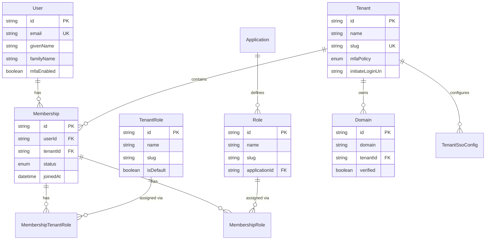
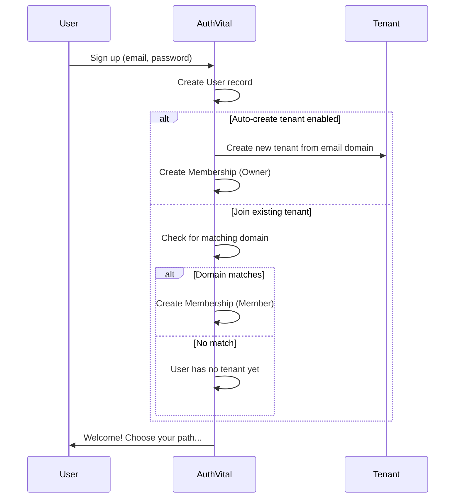
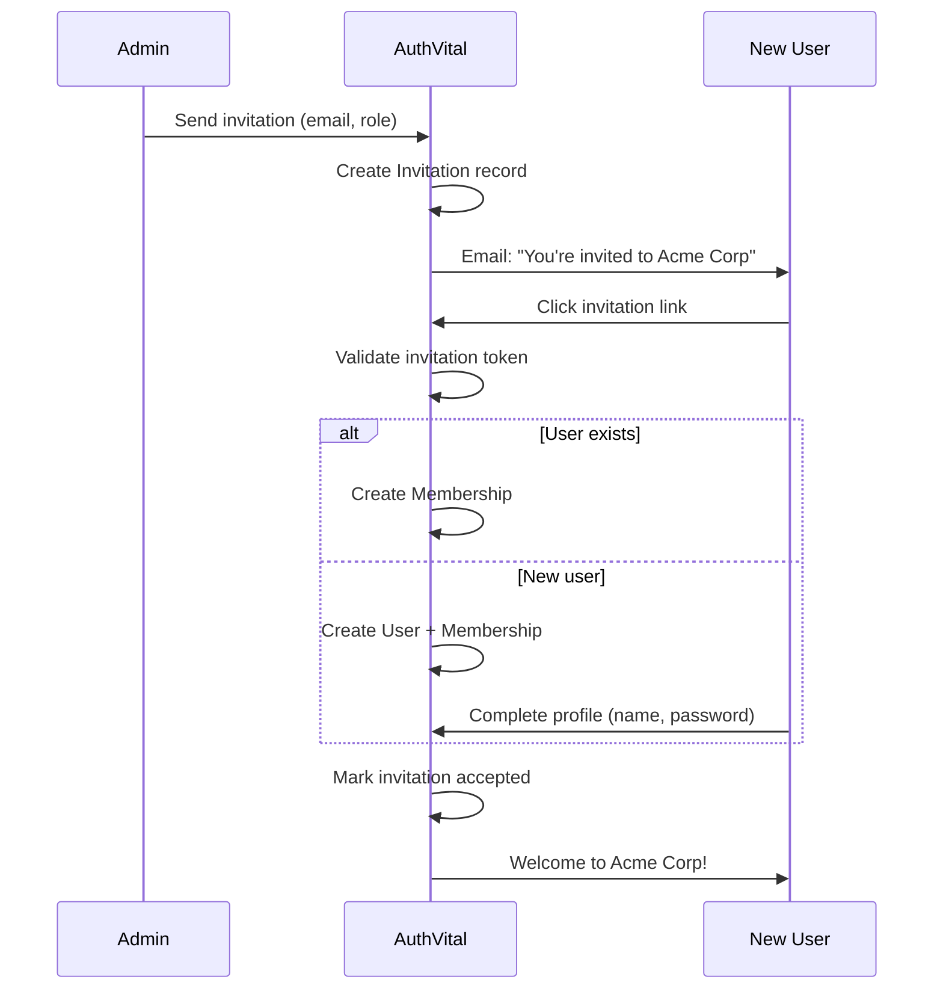
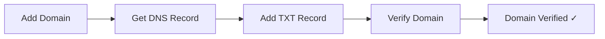

# Multi-Tenancy

> Understanding AuthVital's multi-tenant architecture for B2B applications.

## Overview

AuthVital is built from the ground up for **multi-tenant B2B applications**. Each tenant (organization, workspace, team) is completely isolated with its own:

- Members and roles
- SSO configuration
- MFA policies
- License subscriptions
- Application access settings

## Core Concepts

### Tenant

A **Tenant** represents an organization, company, workspace, or team. It's the primary isolation boundary.

```typescript
interface Tenant {
  id: string;           // UUID
  name: string;         // "Acme Corporation"
  slug: string;         // "acme-corp" (URL-safe, unique)
  settings: object;     // Custom tenant settings
  mfaPolicy: MfaPolicy; // OPTIONAL, REQUIRED, or ENFORCED_AFTER_GRACE
  initiateLoginUri?: string; // Custom login URL
}
```

### Membership

A **Membership** connects a User to a Tenant with a specific status.

```typescript
interface Membership {
  id: string;
  userId: string;
  tenantId: string;
  status: 'ACTIVE' | 'INVITED' | 'SUSPENDED';
  joinedAt: Date;
  roles: TenantRole[];      // Tenant-level roles (Owner, Admin, Member)
  applicationRoles: AppRole[]; // Per-application roles
}
```

### Membership Status

| Status | Description |
|--------|-------------|
| `INVITED` | User has been invited but hasn't accepted yet |
| `ACTIVE` | User is an active member |
| `SUSPENDED` | User's access is temporarily suspended |

## Data Model



## Tenant Roles vs Application Roles

AuthVital distinguishes between two types of roles:

### Tenant Roles

Built-in roles that control tenant-level permissions:

| Role | Permissions |
|------|-------------|
| **Owner** | Full access, can delete tenant, manage billing |
| **Admin** | Manage members, roles, SSO, settings |
| **Member** | Basic access to tenant resources |

```typescript
// Check tenant role
if (user.tenant_role === 'owner') {
  // Can manage billing
}
```

### Application Roles

Custom roles defined per-application that control app-specific permissions:

```typescript
// Application "Project Manager" might have roles:
// - admin: Full project access
// - manager: Can create/edit projects
// - viewer: Read-only access

// Check application role
if (user.app_roles.includes('admin')) {
  // Can manage projects
}
```

## User Journey

### 1. User Signs Up



### 2. User Joins via Invitation



### 3. User Accesses Multiple Tenants

A single user can belong to multiple tenants:

```typescript
// User's tenants
const tenants = await authvital.memberships.listTenantsForUser(req);
// [
//   { id: "t1", name: "Acme Corp", slug: "acme", role: "owner" },
//   { id: "t2", name: "Beta Inc", slug: "beta", role: "member" },
// ]
```

When logging in, users can:
1. Pick a tenant from a selector (org-picker)
2. Be auto-redirected to their only tenant
3. Get a tenant-scoped token for a specific tenant

## Tenant-Scoped Tokens

Tokens can be scoped to a specific tenant for security:

### Unscoped Token (Multi-tenant)

Contains all tenant memberships:

```json
{
  "sub": "user-123",
  "email": "user@example.com",
  "memberships": [
    { "tenant_id": "t1", "role": "owner" },
    { "tenant_id": "t2", "role": "member" }
  ]
}
```

### Scoped Token (Single-tenant)

Locked to one tenant:

```json
{
  "sub": "user-123",
  "email": "user@example.com",
  "tenant_id": "t1",
  "tenant_slug": "acme",
  "tenant_role": "owner",
  "app_roles": ["admin"],
  "app_permissions": ["projects:*", "users:read"]
}
```

### Requesting a Scoped Token

```typescript
// Include tenant_id in authorization request
const authorizeUrl = buildAuthorizeUrl({
  authVitalHost: 'https://auth.yourapp.com',
  clientId: 'your-client-id',
  redirectUri: 'https://yourapp.com/callback',
  tenantId: 'tenant-uuid-here', // Scope to this tenant
  // ...
});
```

## Domain Verification

Tenants can claim and verify domains:



### Purpose

1. **Auto-join**: Users with matching email domains auto-join the tenant
2. **SSO enforcement**: Enforce SSO for domain users
3. **Email validation**: Verify organization ownership

### Adding a Domain

!!! note "Admin Dashboard Only"
    Domain management is performed through the **AuthVital Admin Dashboard**.
    The SDK does not include a `domains` namespace.

1. Go to **Admin Panel** → **Tenants** → Select tenant → **Domains** tab
2. Click **Add Domain** and enter your domain (e.g., `acme.com`)
3. Add the provided TXT record to your DNS:
   ```
   _authvital.acme.com TXT "authvital-verify=abc123"
   ```
4. Click **Verify** once DNS propagates

## Tenant Settings

### MFA Policies

| Policy | Behavior |
|--------|----------|
| `OPTIONAL` | MFA available but not required |
| `REQUIRED` | All members must enable MFA |
| `ENFORCED_AFTER_GRACE` | Required after grace period (default: 7 days) |

```typescript
// Update tenant MFA policy
await authvital.tenants.update('tenant-id', {
  mfaPolicy: 'REQUIRED',
});
```

### SSO Configuration

Tenants can configure their own SSO:

```typescript
await authvital.tenants.configureSso('tenant-id', {
  provider: 'GOOGLE',
  enabled: true,
  clientId: 'tenant-specific-client-id',
  clientSecret: 'tenant-specific-secret',
  enforced: true, // Disable password login
  allowedDomains: ['acme.com'],
});
```

## API Examples

### Create a Tenant

```typescript
// Requires incoming HTTP request for JWT validation
const tenant = await authvital.tenants.create(req, {
  name: 'Acme Corporation',
  slug: 'acme-corp', // Auto-generated if not provided
});
```

### Invite a Member

```typescript
// First, get available tenant roles
const { roles } = await authvital.memberships.getTenantRoles();
const adminRole = roles.find(r => r.slug === 'admin');

// Send invitation (tenantId extracted from JWT automatically)
await authvital.invitations.send(req, {
  email: 'newuser@acme.com',
  roleId: adminRole?.id, // Use role ID, not slug
  givenName: 'John',     // Optional
  familyName: 'Doe',     // Optional
});
```

### List Tenant Members

```typescript
// In a route handler where req is available:
const members = await authvital.memberships.listForTenant(req);
// Uses tenant from JWT automatically!

// With optional filters:
const members = await authvital.memberships.listForTenant(req, {
  status: 'ACTIVE',        // Filter by status
  includeRoles: true,      // Include role details
  appendClientId: true,    // Add client_id to login URIs
});
// [
//   {
//     user: { id, email, givenName, familyName, pictureUrl },
//     membership: { id, status, joinedAt },
//     tenantRoles: [{ id, name, slug }],
//     applicationRoles: [{ id, name, slug, applicationId }],
//   }
// ]
```

### Update Member Role

```typescript
// Update a member's tenant role (requires admin or owner permissions)
await authvital.memberships.setMemberRole(
  request,          // HTTP request for JWT validation
  'membership-id',  // Membership ID to update
  'admin'           // New role slug
);
```

!!! info "Role Hierarchy"
    Role changes are governed by a strict hierarchy:
    - Owners can change anyone's role
    - Admins can change admins and members, but not owners
    - Members cannot change roles

## Single-Tenant Mode

For simpler deployments, AuthVital supports **single-tenant mode**:

```typescript
// Instance configuration
{
  singleTenantMode: true,
  defaultTenantId: 'the-only-tenant-id',
}
```

In this mode:
- All signups auto-join the default tenant
- No tenant picker is shown
- Tokens are always scoped to the default tenant
- Simpler UX for single-organization deployments

## Best Practices

### 1. Use Tenant-Scoped Tokens

Always request tenant-scoped tokens when users select a tenant:

```typescript
// Good: Scoped to specific tenant
const token = await getToken({ tenantId: 'selected-tenant' });

// Avoid: Unscoped tokens in multi-tenant contexts
const token = await getToken(); // Contains all memberships
```

### 2. Validate Tenant Access

Always verify the user has access to the requested tenant:

```typescript
app.get('/api/tenant/:tenantId/data', requireAuth, async (req, res) => {
  const { tenantId } = req.params;
  
  // Check token is scoped to this tenant
  if (req.user.tenant_id !== tenantId) {
    return res.status(403).json({ error: 'Access denied' });
  }
  
  // Proceed...
});
```

### 3. Separate Tenant Data

Keep tenant data isolated in your database:

```prisma
model Project {
  id        String @id
  name      String
  tenantId  String @map("tenant_id")
  
  @@index([tenantId])
}
```

```typescript
// Always filter by tenantId
const projects = await prisma.project.findMany({
  where: { tenantId: req.user.tenant_id },
});
```

### 4. Handle Tenant Switching

Allow users to switch tenants gracefully:

```typescript
function TenantSwitcher() {
  const { switchTenant, currentTenant, tenants } = useAuth();
  
  return (
    <select 
      value={currentTenant.id}
      onChange={(e) => switchTenant(e.target.value)}
    >
      {tenants.map(t => (
        <option key={t.id} value={t.id}>{t.name}</option>
      ))}
    </select>
  );
}
```

---

## Related Documentation

- [Access Control (RBAC)](./access-control.md)
- [Licensing System](./licensing.md)
- [SSO Configuration](../security/sso.md)
- [Architecture Overview](./architecture.md)
