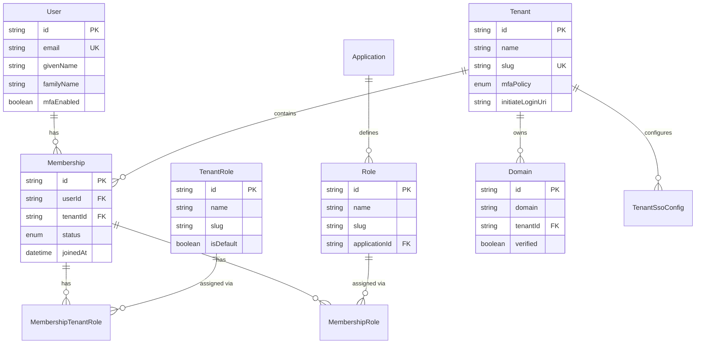
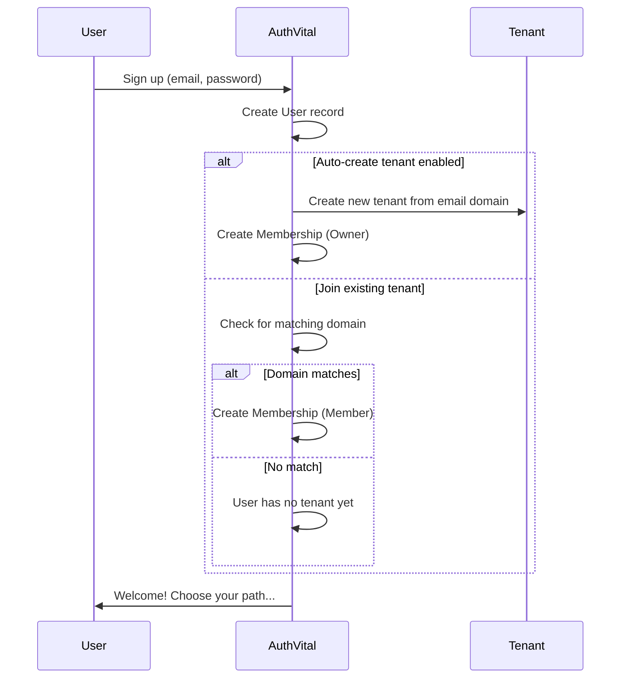
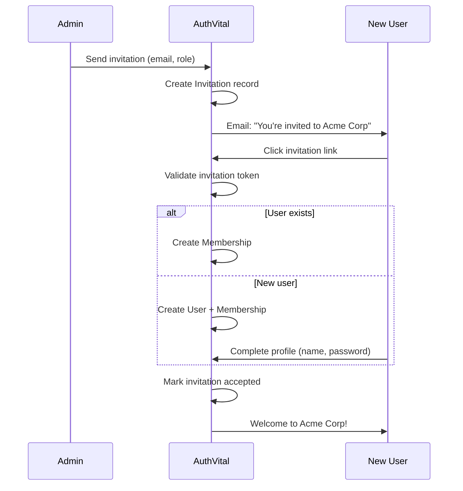
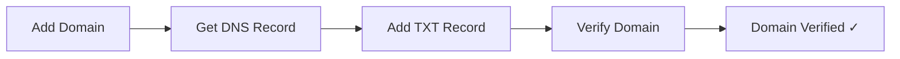

# Multi-Tenancy

> Understanding AuthVital's multi-tenant architecture for B2B applications.

!!! warning "Code samples: the `authvital.tenants.*` / `authvital.memberships.*` API is not real"
    The architecture described here is accurate, but the SDK snippets use a fluent
    API that **does not exist**. Real equivalents (M2M):

    - `authvital.memberships.listTenantsForUser` -> `client.integration.listUserTenants({ userId })`
    - `authvital.memberships.listForTenant` -> `client.integration.listTenantMembers({ tenantId })`
    - `authvital.memberships.getTenantRoles` -> `client.integration.getTenantRoles({ tenantId })`
    - `authvital.memberships.setMemberRole` -> `client.integration.setMemberRole({ membershipId, roleId, applicationId })` (sets an **application** role; `roleId` = an app Role id)
    - `authvital.invitations.send` -> `client.integration.sendInvitation({ tenantId, email, roleId, clientId? })` (`roleId` is a **required** TenantRole id)
    - **Tenant create/update and SSO config (`authvital.tenants.create/update/configureSso`) are NOT in the SDK** — use the REST endpoints under `/api/tenants/*` (see [Tenant API](../api/tenant-api.md)).

    `client` = `createServerClient({ authVitalHost, clientId, clientSecret })`.

## Overview

AuthVital is built from the ground up for **multi-tenant B2B applications**. Each tenant (organization, workspace, team) is completely isolated with its own:

- Members and roles
- SSO configuration
- MFA policies
- License subscriptions
- Application access settings

## Core Concepts

### Tenant

A **Tenant** represents an organization, company, workspace, or team. It's the primary isolation boundary.

```typescript
interface Tenant {
  id: string;           // UUID
  name: string;         // "Acme Corporation"
  slug: string;         // "acme-corp" (URL-safe, unique)
  settings: object;     // Custom tenant settings
  mfaPolicy: MfaPolicy; // DISABLED, OPTIONAL, ENCOURAGED, or REQUIRED
  initiateLoginUri?: string; // Custom login URL
}
```

### Membership

A **Membership** connects a User to a Tenant with a specific status.

```typescript
interface Membership {
  id: string;
  userId: string;
  tenantId: string;
  status: 'ACTIVE' | 'INVITED' | 'SUSPENDED';
  joinedAt: Date;
  roles: TenantRole[];      // Tenant-level roles (Owner, Admin, Member)
  applicationRoles: AppRole[]; // Per-application roles
}
```

### Membership Status

| Status | Description |
|--------|-------------|
| `INVITED` | User has been invited but hasn't accepted yet |
| `ACTIVE` | User is an active member |
| `SUSPENDED` | User's access is temporarily suspended |

## Data Model


```mermaid
erDiagram
    User ||--o{ Membership : "has"
    Tenant ||--o{ Membership : "contains"
    Membership ||--o{ MembershipTenantRole : "has"
    TenantRole ||--o{ MembershipTenantRole : "assigned via"
    Membership ||--o{ MembershipRole : "has"
    Role ||--o{ MembershipRole : "assigned via"
    Application ||--o{ Role : "defines"
    Tenant ||--o{ Domain : "owns"
    Tenant ||--o{ TenantSsoConfig : "configures"
    
    User {
        string id PK
        string email UK
        string givenName
        string familyName
        boolean mfaEnabled
    }
    
    Tenant {
        string id PK
        string name
        string slug UK
        enum mfaPolicy
        string initiateLoginUri
    }
    
    Membership {
        string id PK
        string userId FK
        string tenantId FK
        enum status
        datetime joinedAt
    }
    
    TenantRole {
        string id PK
        string name
        string slug
        boolean isDefault
    }
    
    Role {
        string id PK
        string name
        string slug
        string applicationId FK
    }
    
    Domain {
        string id PK
        string domain
        string tenantId FK
        boolean verified
    }
```

## Tenant Roles vs Application Roles

AuthVital distinguishes between two types of roles:

### Tenant Roles

Built-in roles that control tenant-level permissions:

| Role | Permissions |
|------|-------------|
| **Owner** | Full access, can delete tenant, manage billing |
| **Admin** | Manage members, roles, SSO, settings |
| **Member** | Basic access to tenant resources |

```typescript
// Check tenant role
if (user.tenant_role === 'owner') {
  // Can manage billing
}
```

### Application Roles

Custom roles defined per-application that control app-specific permissions:

```typescript
// Application "Project Manager" might have roles:
// - admin: Full project access
// - manager: Can create/edit projects
// - viewer: Read-only access

// Check application role
if (user.app_roles.includes('admin')) {
  // Can manage projects
}
```

## User Journey

### 1. User Signs Up


```mermaid
sequenceDiagram
    participant U as User
    participant A as AuthVital
    participant T as Tenant

    U->>A: Sign up (email, password)
    A->>A: Create User record
    
    alt Auto-create tenant enabled
        A->>T: Create new tenant from email domain
        A->>A: Create Membership (Owner)
    else Join existing tenant
        A->>A: Check for matching domain
        alt Domain matches
            A->>A: Create Membership (Member)
        else No match
            A->>A: User has no tenant yet
        end
    end
    
    A->>U: Welcome! Choose your path...
```

### 2. User Joins via Invitation


```mermaid
sequenceDiagram
    participant Admin
    participant A as AuthVital
    participant U as New User

    Admin->>A: Send invitation (email, role)
    A->>A: Create Invitation record
    A->>U: Email: "You're invited to Acme Corp"
    
    U->>A: Click invitation link
    A->>A: Validate invitation token
    
    alt User exists
        A->>A: Create Membership
    else New user
        A->>A: Create User + Membership
        U->>A: Complete profile (name, password)
    end
    
    A->>A: Mark invitation accepted
    A->>U: Welcome to Acme Corp!
```

### 3. User Accesses Multiple Tenants

A single user can belong to multiple tenants:

```typescript
import { createServerClient } from '@authvital/server';

const client = createServerClient({ authVitalHost, clientId, clientSecret });

// User's tenants (M2M integration client)
const tenants = await client.integration.listUserTenants({ userId });
// [
//   { id: "t1", name: "Acme Corp", slug: "acme", role: "owner" },
//   { id: "t2", name: "Beta Inc", slug: "beta", role: "member" },
// ]
```

When logging in, users can:
1. Pick a tenant from a selector (org-picker)
2. Be auto-redirected to their only tenant
3. Get a tenant-scoped token for a specific tenant

## Tenant-Scoped Tokens

Tokens can be scoped to a specific tenant for security:

### Unscoped Token (Multi-tenant)

Contains all tenant memberships:

```json
{
  "sub": "user-123",
  "email": "user@example.com",
  "memberships": [
    { "tenant_id": "t1", "role": "owner" },
    { "tenant_id": "t2", "role": "member" }
  ]
}
```

### Scoped Token (Single-tenant)

Locked to one tenant:

```json
{
  "sub": "user-123",
  "email": "user@example.com",
  "tenant_id": "t1",
  "tenant_slug": "acme",
  "tenant_role": "owner",
  "app_roles": ["admin"],
  "app_permissions": ["projects:*", "users:read"]
}
```

### Requesting a Scoped Token

```typescript
import { OAuthFlow } from '@authvital/server';

const oauth = new OAuthFlow({
  authVitalHost: 'https://auth.yourapp.com',
  clientId: 'your-client-id',
  redirectUri: 'https://yourapp.com/callback',
});

// Start the PKCE flow. The user selects/uses a tenant during login and the
// issued access token is scoped to that tenant (tenant_id claim).
const { authorizeUrl, state, codeVerifier } = await oauth.startFlow();
```

## Domain Verification

Tenants can claim and verify domains:


```mermaid
graph LR
    A[Add Domain] --> B[Get DNS Record]
    B --> C[Add TXT Record]
    C --> D[Verify Domain]
    D --> E[Domain Verified ✓]
```

### Purpose

1. **Auto-join**: Users with matching email domains auto-join the tenant
2. **SSO enforcement**: Enforce SSO for domain users
3. **Email validation**: Verify organization ownership

### Adding a Domain

!!! note "Admin Dashboard Only"
    Domain management is performed through the **AuthVital Admin Dashboard**.
    The SDK does not include a `domains` namespace.

1. Go to **Admin Panel** → **Tenants** → Select tenant → **Domains** tab
2. Click **Add Domain** and enter your domain (e.g., `acme.com`)
3. Add the provided TXT record to your DNS:
   ```
   _authvital.acme.com TXT "authvital-verify=abc123"
   ```
4. Click **Verify** once DNS propagates

## Tenant Settings

### MFA Policies

| Policy | Behavior |
|--------|----------|
| `DISABLED` | MFA is disabled for the tenant |
| `OPTIONAL` | MFA available but not required |
| `ENCOURAGED` | Members are prompted to enable MFA but not required |
| `REQUIRED` | All members must enable MFA |

"Enforced after a grace period" is not a separate policy value — it is
`REQUIRED` combined with `mfaGracePeriodDays > 0` (default: 7 days). Members
who joined before the policy change get the full window from the moment the
policy was switched; a grace period of `0` enforces immediately.

!!! note "Tenant settings are managed via Admin Console / REST"
    Updating a tenant's MFA policy is **not** exposed on the Server SDK. Use
    the AuthVital Admin Console, or the REST endpoints under `/api/tenants/*`
    (see [Tenant API](../api/tenant-api.md)).

### SSO Configuration

Tenants can configure their own SSO:

!!! note "SSO configuration is managed via Admin Console / REST"
    Per-tenant SSO configuration is **not** exposed on the Server SDK. Configure
    it in the AuthVital Admin Console, or via the REST endpoints under
    `/api/tenants/*` (see [SSO](../security/sso.md)).

## API Examples

### Create a Tenant

!!! note "Tenant creation is managed via Admin Console / REST"
    Creating a tenant is **not** exposed on the Server SDK. Use the AuthVital
    Admin Console, or the REST endpoints under `/api/tenants/*`
    (see [Tenant API](../api/tenant-api.md)).

### Invite a Member

```typescript
// First, get available tenant roles (M2M integration client)
const { roles } = await client.integration.getTenantRoles({ tenantId });
const adminRole = roles.find(r => r.slug === 'admin');

// Send invitation
await client.integration.sendInvitation({
  tenantId,
  email: 'newuser@acme.com',
  roleId: adminRole?.slug, // role identifier for the invited member
  givenName: 'John',       // Optional
  familyName: 'Doe',       // Optional
});
```

### List Tenant Members

```typescript
// List members of a tenant (M2M integration client)
const { memberships } = await client.integration.listTenantMembers({
  tenantId,
});

// With optional filters:
const { memberships: activeMembers } = await client.integration.listTenantMembers({
  tenantId,
  status: 'ACTIVE',        // Filter by status
  includeRoles: true,      // Include role details
});
// memberships: [
//   { id, userId, tenantId, status, email, givenName, familyName,
//     roles: [{ slug, name }], tenantRoles: [{ slug, name }] }
// ]
```

### Update Member Role

```typescript
// Assign a member an APPLICATION role (M2M integration client).
// roleId = an app Role id (from getApplicationRoles); applicationId = its app.
await client.integration.setMemberRole({
  membershipId: 'membership-id',
  roleId: 'app-role-id',
  applicationId: 'application-id',
});
```

!!! info "Role Hierarchy"
    Role changes are governed by a strict hierarchy:
    - Owners can change anyone's role
    - Admins can change admins and members, but not owners
    - Members cannot change roles

## Single-Tenant Mode

For simpler deployments, AuthVital supports **single-tenant mode**:

```typescript
// Instance configuration
{
  singleTenantMode: true,
  defaultTenantId: 'the-only-tenant-id',
}
```

In this mode:
- All signups auto-join the default tenant
- No tenant picker is shown
- Tokens are always scoped to the default tenant
- Simpler UX for single-organization deployments

## Best Practices

### 1. Use Tenant-Scoped Tokens

Always request tenant-scoped tokens when users select a tenant:

```typescript
// Good: Scoped to specific tenant
const token = await getToken({ tenantId: 'selected-tenant' });

// Avoid: Unscoped tokens in multi-tenant contexts
const token = await getToken(); // Contains all memberships
```

### 2. Validate Tenant Access

Always verify the user has access to the requested tenant:

```typescript
app.get('/api/tenant/:tenantId/data', requireAuth, async (req, res) => {
  const { tenantId } = req.params;
  
  // Check token is scoped to this tenant
  if (req.user.tenant_id !== tenantId) {
    return res.status(403).json({ error: 'Access denied' });
  }
  
  // Proceed...
});
```

### 3. Separate Tenant Data

Keep tenant data isolated in your database:

```prisma
model Project {
  id        String @id
  name      String
  tenantId  String @map("tenant_id")
  
  @@index([tenantId])
}
```

```typescript
// Always filter by tenantId
const projects = await prisma.project.findMany({
  where: { tenantId: req.user.tenant_id },
});
```

### 4. Handle Tenant Switching

Allow users to switch tenants gracefully:

```typescript
function TenantSwitcher() {
  const { switchTenant, currentTenant, tenants } = useAuth();
  
  return (
    <select 
      value={currentTenant.id}
      onChange={(e) => switchTenant(e.target.value)}
    >
      {tenants.map(t => (
        <option key={t.id} value={t.id}>{t.name}</option>
      ))}
    </select>
  );
}
```

---

## Related Documentation

- [Access Control (RBAC)](./access-control.md)
- [Licensing System](./licensing.md)
- [SSO Configuration](../security/sso.md)
- [Architecture Overview](./architecture.md)
