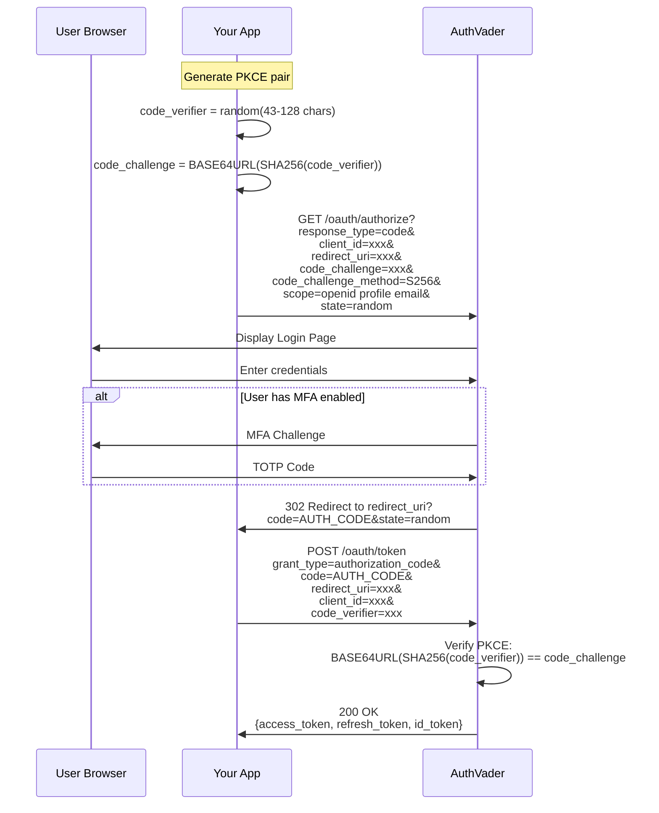

# OAuth 2.0 / OIDC Flows

> Complete guide to AuthVader's OAuth 2.0 and OpenID Connect implementation.

## Overview

AuthVader implements the following OAuth 2.0 / OIDC standards:

| Standard | Support |
|----------|--------|
| OAuth 2.0 Authorization Code | ✅ Full |
| PKCE (RFC 7636) | ✅ Required for SPAs |
| OpenID Connect Core 1.0 | ✅ Full |
| OIDC Discovery | ✅ Full |
| Token Refresh | ✅ With rotation |
| Client Credentials | ✅ For M2M |

## Authorization Code Flow with PKCE

This is the recommended flow for Single Page Applications (SPAs) and mobile apps.

### Flow Diagram



### Step-by-Step Implementation

#### 1. Generate PKCE Challenge

```typescript
import { generatePKCE } from '@authvader/sdk/server';

// Or implement manually:
function generatePKCE() {
  // Generate random verifier (43-128 characters)
  const verifier = crypto.randomBytes(32).toString('base64url');
  
  // Create challenge (SHA256 hash of verifier)
  const challenge = crypto
    .createHash('sha256')
    .update(verifier)
    .digest('base64url');
  
  return { codeVerifier: verifier, codeChallenge: challenge };
}

const { codeVerifier, codeChallenge } = generatePKCE();
// Store codeVerifier securely (session storage, not localStorage)
sessionStorage.setItem('pkce_verifier', codeVerifier);
```

#### 2. Build Authorization URL

```typescript
import { buildAuthorizeUrl } from '@authvader/sdk/server';

const authorizeUrl = buildAuthorizeUrl({
  authVaderHost: 'https://auth.yourapp.com',
  clientId: 'your-client-id',
  redirectUri: 'https://yourapp.com/callback',
  codeChallenge,
  codeChallengeMethod: 'S256',
  scope: 'openid profile email',
  state: crypto.randomBytes(16).toString('hex'),
});

// Redirect user
window.location.href = authorizeUrl;
```

**Authorization URL Parameters:**

| Parameter | Required | Description |
|-----------|----------|-------------|
| `response_type` | Yes | Must be `code` |
| `client_id` | Yes | Your application's client ID |
| `redirect_uri` | Yes | Must match registered URI exactly |
| `code_challenge` | Yes* | PKCE challenge (*required for SPAs) |
| `code_challenge_method` | Yes* | Must be `S256` |
| `scope` | No | Space-separated scopes (default: `openid`) |
| `state` | Recommended | CSRF protection |
| `nonce` | Recommended | ID token replay protection |
| `tenant_id` | No | Scope token to specific tenant |

#### 3. Handle Callback

```typescript
// callback.ts - Your /callback route handler
const urlParams = new URLSearchParams(window.location.search);
const code = urlParams.get('code');
const state = urlParams.get('state');
const error = urlParams.get('error');

// Check for errors
if (error) {
  console.error('OAuth error:', urlParams.get('error_description'));
  return;
}

// Verify state matches (CSRF protection)
if (state !== sessionStorage.getItem('oauth_state')) {
  throw new Error('State mismatch - possible CSRF attack');
}

// Get stored PKCE verifier
const codeVerifier = sessionStorage.getItem('pkce_verifier');
```

#### 4. Exchange Code for Tokens

```typescript
import { exchangeCodeForTokens } from '@authvader/sdk/server';

const tokens = await exchangeCodeForTokens({
  authVaderHost: 'https://auth.yourapp.com',
  clientId: 'your-client-id',
  code,
  codeVerifier,
  redirectUri: 'https://yourapp.com/callback',
});

// tokens contains:
// - access_token: JWT for API calls
// - refresh_token: For getting new access tokens
// - id_token: User identity (OIDC)
// - expires_in: Token lifetime in seconds
// - token_type: "Bearer"
```

**Token Request (Raw HTTP):**

```http
POST /oauth/token HTTP/1.1
Host: auth.yourapp.com
Content-Type: application/x-www-form-urlencoded

grant_type=authorization_code
&code=AUTH_CODE_HERE
&redirect_uri=https://yourapp.com/callback
&client_id=your-client-id
&code_verifier=YOUR_PKCE_VERIFIER
```

## Tenant-Scoped Tokens

For multi-tenant applications, you can request tokens scoped to a specific tenant:

```typescript
const authorizeUrl = buildAuthorizeUrl({
  authVaderHost: 'https://auth.yourapp.com',
  clientId: 'your-client-id',
  redirectUri: 'https://yourapp.com/callback',
  codeChallenge,
  scope: 'openid profile email',
  tenantId: 'tenant-uuid-here', // Scope to specific tenant
});
```

The resulting token will include:
- `tenant_id`: The tenant UUID
- `tenant_slug`: The tenant's URL-safe identifier
- `tenant_role`: User's role within that tenant
- `app_roles`: Application-specific roles for this tenant
- `app_permissions`: Granted permissions

## Token Refresh

Access tokens expire (default: 1 hour). Use the refresh token to get new ones:

```typescript
// POST /oauth/token
const response = await fetch('https://auth.yourapp.com/oauth/token', {
  method: 'POST',
  headers: { 'Content-Type': 'application/x-www-form-urlencoded' },
  body: new URLSearchParams({
    grant_type: 'refresh_token',
    refresh_token: storedRefreshToken,
    client_id: 'your-client-id',
  }),
});

const { access_token, refresh_token } = await response.json();
// Note: AuthVader rotates refresh tokens - always store the new one!
```

## Client Credentials Flow (M2M)

For machine-to-machine authentication (backend services, cron jobs):

```typescript
// POST /oauth/token
const response = await fetch('https://auth.yourapp.com/oauth/token', {
  method: 'POST',
  headers: { 'Content-Type': 'application/x-www-form-urlencoded' },
  body: new URLSearchParams({
    grant_type: 'client_credentials',
    client_id: 'your-machine-client-id',
    client_secret: 'your-client-secret',
    scope: 'system:admin',
  }),
});

const { access_token } = await response.json();
```

**Requirements:**
- Application must be type `MACHINE` (not `SPA`)
- `client_secret` is required
- Tokens are not user-scoped

## OIDC Discovery

AuthVader exposes standard OIDC discovery endpoints:

### OpenID Configuration

```bash
GET /.well-known/openid-configuration
```

Response:
```json
{
  "issuer": "https://auth.yourapp.com",
  "authorization_endpoint": "https://auth.yourapp.com/oauth/authorize",
  "token_endpoint": "https://auth.yourapp.com/oauth/token",
  "userinfo_endpoint": "https://auth.yourapp.com/oauth/userinfo",
  "jwks_uri": "https://auth.yourapp.com/.well-known/jwks.json",
  "scopes_supported": ["openid", "profile", "email", "offline_access"],
  "response_types_supported": ["code"],
  "grant_types_supported": ["authorization_code", "refresh_token", "client_credentials"],
  "token_endpoint_auth_methods_supported": ["client_secret_post", "none"],
  "code_challenge_methods_supported": ["S256"],
  "subject_types_supported": ["public"],
  "id_token_signing_alg_values_supported": ["EdDSA"]
}
```

### JWKS (JSON Web Key Set)

```bash
GET /.well-known/jwks.json
```

Response:
```json
{
  "keys": [
    {
      "kty": "OKP",
      "crv": "Ed25519",
      "x": "...",
      "kid": "key-id-1",
      "use": "sig",
      "alg": "EdDSA"
    }
  ]
}
```

## Scopes

| Scope | Claims Included |
|-------|----------------|
| `openid` | `sub`, `iss`, `aud`, `exp`, `iat` |
| `profile` | `name`, `given_name`, `family_name`, `picture`, `locale` |
| `email` | `email`, `email_verified` |
| `offline_access` | Enables refresh tokens |

## Token Structure

### Access Token (JWT)

```typescript
{
  // Standard claims
  "sub": "user-uuid",           // Subject (user ID)
  "iss": "https://auth.yourapp.com",  // Issuer
  "aud": "your-client-id",      // Audience
  "exp": 1699999999,            // Expiration
  "iat": 1699996399,            // Issued at
  
  // Profile claims
  "email": "user@example.com",
  "given_name": "Jane",
  "family_name": "Smith",
  "picture": "https://...",
  
  // Tenant claims (if tenant-scoped)
  "tenant_id": "tenant-uuid",
  "tenant_slug": "acme-corp",
  
  // Authorization claims
  "app_roles": ["admin", "member"],
  "app_permissions": ["users:read", "users:write"],
  
  // License claims
  "license": {
    "type": "pro",
    "name": "Pro Plan",
    "features": ["sso", "api-access", "analytics"]
  }
}
```

### ID Token

The ID token contains identity claims only (no authorization):

```typescript
{
  "sub": "user-uuid",
  "iss": "https://auth.yourapp.com",
  "aud": "your-client-id",
  "exp": 1699999999,
  "iat": 1699996399,
  "nonce": "random-nonce",      // If provided in auth request
  "email": "user@example.com",
  "email_verified": true,
  "given_name": "Jane",
  "family_name": "Smith"
}
```

## Error Handling

### Authorization Errors

Errors during authorization redirect to your `redirect_uri` with error parameters:

```
https://yourapp.com/callback?error=access_denied&error_description=User+cancelled
```

| Error | Description |
|-------|-------------|
| `invalid_request` | Missing or invalid parameters |
| `unauthorized_client` | Client not authorized for this grant |
| `access_denied` | User denied the request |
| `invalid_scope` | Requested scope is invalid |
| `server_error` | Unexpected server error |

### Token Errors

Token endpoint returns JSON errors:

```json
{
  "error": "invalid_grant",
  "error_description": "Authorization code expired or already used"
}
```

| Error | Description |
|-------|-------------|
| `invalid_request` | Missing required parameter |
| `invalid_client` | Client authentication failed |
| `invalid_grant` | Invalid code, expired, or PKCE mismatch |
| `unauthorized_client` | Client not authorized for grant type |

## Security Best Practices

### ✅ Do

- Always use PKCE for SPAs (S256 method)
- Store tokens securely (memory for access, httpOnly cookies for refresh)
- Validate `state` parameter to prevent CSRF
- Validate `nonce` in ID tokens to prevent replay attacks
- Check token expiration before use
- Handle token refresh proactively

### ❌ Don't

- Never store tokens in localStorage (XSS vulnerable)
- Never expose `client_secret` to browsers
- Don't skip PKCE validation
- Don't ignore token expiration
- Don't hardcode redirect URIs

## Using with the SDK

The SDK handles most of this automatically:

```tsx
import { AuthVaderProvider, useAuthVader } from '@authvader/sdk/client';

// Provider handles PKCE, token storage, refresh automatically
<AuthVaderProvider
  authVaderHost="https://auth.yourapp.com"
  clientId="your-client-id"
>
  <App />
</AuthVaderProvider>

// Hook handles the OAuth flow
function LoginButton() {
  const { login, logout, isAuthenticated } = useAuthVader();
  
  return isAuthenticated 
    ? <button onClick={logout}>Logout</button>
    : <button onClick={login}>Login</button>;
}
```

---

## Related Documentation

- [Architecture Overview](./architecture.md)
- [JWT Claims Reference](../reference/jwt-claims.md)
- [Client SDK Guide](../sdk/client-sdk.md)
- [Server SDK Guide](../sdk/server-sdk.md)
