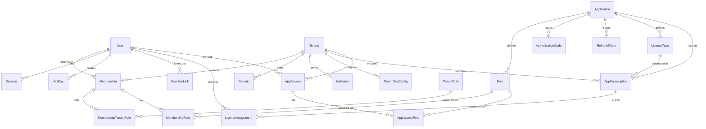

# Data Models Reference

> Complete reference for AuthVader's data models and entity relationships.

## Entity Relationship Diagram



## Core Models

### User

The primary identity model for human users and service accounts.

```typescript
interface User {
  // Identity
  id: string;           // UUID (used as `sub` in JWT)
  email: string | null; // Unique, null for anonymous
  username: string | null; // Optional unique handle
  
  // Profile (OIDC claims)
  displayName: string | null;
  givenName: string | null;
  familyName: string | null;
  middleName: string | null;
  nickname: string | null;
  pictureUrl: string | null;
  website: string | null;
  gender: string | null;
  birthdate: string | null;  // YYYY-MM-DD
  zoneinfo: string | null;   // IANA timezone
  locale: string | null;     // e.g., "en-US"
  
  // Verification
  emailVerified: boolean;
  phone: string | null;      // E.164 format
  phoneVerified: boolean;
  
  // Authentication
  passwordHash: string | null; // Null for SSO-only users
  mfaEnabled: boolean;
  mfaSecret: string | null;    // Encrypted TOTP secret
  mfaBackupCodes: string[];    // Hashed backup codes
  mfaVerifiedAt: Date | null;
  
  // Account Type
  isMachine: boolean;    // Service account
  isAnonymous: boolean;  // Anonymous user
  
  // Password Reset
  passwordResetToken: string | null;  // Hashed
  passwordResetExpires: Date | null;
  
  // Timestamps
  createdAt: Date;
  updatedAt: Date;
  
  // Relations
  memberships: Membership[];
  sessions: Session[];
  apiKeys: ApiKey[];
  ssoLinks: UserSsoLink[];
  licenseAssignments: LicenseAssignment[];
  appAccess: AppAccess[];
}
```

### Tenant

Organization/workspace containing members.

```typescript
interface Tenant {
  id: string;           // UUID
  name: string;         // Display name
  slug: string;         // URL-safe identifier (unique)
  settings: object;     // Custom tenant settings
  
  // Login Configuration
  initiateLoginUri: string | null; // Custom login URL
  
  // MFA Policy
  mfaPolicy: 'OPTIONAL' | 'REQUIRED' | 'ENFORCED_AFTER_GRACE';
  mfaGracePeriodDays: number;
  
  // Timestamps
  createdAt: Date;
  updatedAt: Date;
  
  // Relations
  memberships: Membership[];
  domains: Domain[];
  invitations: Invitation[];
  ssoConfigs: TenantSsoConfig[];
  appSubscriptions: AppSubscription[];
  appAccess: AppAccess[];
}
```

### Membership

Links users to tenants with roles.

```typescript
interface Membership {
  id: string;
  userId: string;
  tenantId: string;
  status: 'INVITED' | 'ACTIVE' | 'SUSPENDED';
  joinedAt: Date | null;
  
  // Timestamps
  createdAt: Date;
  updatedAt: Date;
  
  // Relations
  user: User;
  tenant: Tenant;
  tenantRoles: TenantRole[];      // Via MembershipTenantRole
  applicationRoles: Role[];        // Via MembershipRole
}
```

## OAuth Models

### Application

OAuth client configuration.

```typescript
interface Application {
  id: string;
  name: string;
  slug: string;
  description: string | null;
  type: 'SPA' | 'MACHINE';
  
  // OAuth Credentials
  clientId: string;        // UUID, unique
  clientSecret: string | null; // Hashed, MACHINE only
  
  // OAuth URIs
  redirectUris: string[];
  postLogoutRedirectUris: string[];
  allowedWebOrigins: string[];
  initiateLoginUri: string | null;
  
  // Token Settings
  accessTokenTtl: number;   // Seconds
  refreshTokenTtl: number;  // Seconds
  
  // Branding
  brandingName: string | null;
  brandingLogoUrl: string | null;
  brandingIconUrl: string | null;
  brandingPrimaryColor: string | null;
  brandingBackgroundColor: string | null;
  brandingAccentColor: string | null;
  brandingSupportUrl: string | null;
  brandingPrivacyUrl: string | null;
  brandingTermsUrl: string | null;
  
  // Licensing
  licensingMode: 'FREE' | 'PER_SEAT' | 'TENANT_WIDE';
  defaultLicenseTypeId: string | null;
  defaultSeatCount: number;
  autoProvisionOnSignup: boolean;
  autoGrantToOwner: boolean;
  availableFeatures: FeatureDefinition[];
  allowMixedLicensing: boolean;
  
  // Access Control
  accessMode: 'AUTOMATIC' | 'MANUAL_AUTO_GRANT' | 'MANUAL_NO_DEFAULT' | 'DISABLED';
  
  // Webhooks
  webhookUrl: string | null;
  webhookEnabled: boolean;
  webhookEvents: string[];
  
  // Status
  isActive: boolean;
  createdAt: Date;
  updatedAt: Date;
}
```

### AuthorizationCode

Pending OAuth authorization codes.

```typescript
interface AuthorizationCode {
  id: string;
  code: string;          // UUID, unique
  redirectUri: string;
  scope: string | null;
  state: string | null;
  nonce: string | null;
  
  // PKCE
  codeChallenge: string | null;
  codeChallengeMethod: 'S256' | 'PLAIN' | null;
  
  // Tenant Scoping
  tenantId: string | null;
  tenantSubdomain: string | null;
  
  // Lifecycle
  expiresAt: Date;
  usedAt: Date | null;
  createdAt: Date;
  
  // Relations
  userId: string;
  applicationId: string;
}
```

### RefreshToken

Long-lived session tokens.

```typescript
interface RefreshToken {
  id: string;             // UUID (used as `sid` in JWT)
  scope: string | null;
  expiresAt: Date;
  
  // Revocation
  revoked: boolean;
  revokedAt: Date | null;
  
  // Metadata
  userAgent: string | null;
  ipAddress: string | null;
  
  // Tenant Scoping
  tenantId: string | null;
  tenantSubdomain: string | null;
  
  createdAt: Date;
  
  // Relations
  userId: string;
  applicationId: string;
}
```

## Authorization Models

### Role

Application-specific roles with permissions.

```typescript
interface Role {
  id: string;
  name: string;
  slug: string;
  description: string | null;
  applicationId: string;
  isDefault: boolean;      // Auto-assign to new users
  
  // Timestamps
  createdAt: Date;
  updatedAt: Date;
  
  // Relations
  permissions: Permission[];  // Via RolePermission
}
```

### TenantRole

Built-in tenant-level roles.

```typescript
interface TenantRole {
  id: string;
  name: string;          // "Owner", "Admin", "Member"
  slug: string;          // "owner", "admin", "member"
  description: string | null;
  isDefault: boolean;    // Assigned to new members
  
  // Permissions for this role
  permissions: string[];
  
  // Timestamps
  createdAt: Date;
  updatedAt: Date;
}
```

### AppAccess

User's access to an application within a tenant.

```typescript
interface AppAccess {
  id: string;
  userId: string;
  tenantId: string;
  applicationId: string;
  
  // Timestamps
  grantedAt: Date;
  updatedAt: Date;
  
  // Relations
  roles: Role[];  // Via AppAccessRole
}
```

## Licensing Models

### LicenseType

Defines license tiers for an application.

```typescript
interface LicenseType {
  id: string;
  name: string;           // "Pro Plan"
  slug: string;           // "pro"
  description: string | null;
  applicationId: string;
  features: Record<string, boolean>;  // Feature flags
  displayOrder: number;
  
  createdAt: Date;
  updatedAt: Date;
}
```

### AppSubscription

Tenant's license subscription.

```typescript
interface AppSubscription {
  id: string;
  tenantId: string;
  applicationId: string;
  licenseTypeId: string;
  
  // Seat Management
  quantityPurchased: number;
  
  // Status
  status: 'ACTIVE' | 'TRIALING' | 'PAST_DUE' | 'CANCELED' | 'EXPIRED';
  currentPeriodEnd: Date;
  
  // Timestamps
  createdAt: Date;
  updatedAt: Date;
}
```

### LicenseAssignment

Individual user license within a subscription.

```typescript
interface LicenseAssignment {
  id: string;
  userId: string;
  tenantId: string;
  subscriptionId: string;
  
  assignedAt: Date;
  assignedBy: string | null;  // User ID who assigned
}
```

## SSO Models

### SsoProvider

Instance-level SSO configuration.

```typescript
interface SsoProvider {
  id: string;
  provider: 'GOOGLE' | 'MICROSOFT';
  enabled: boolean;
  clientId: string;
  clientSecretEnc: string;  // Encrypted
  scopes: string[];
  allowedDomains: string[];
  autoCreateUser: boolean;
  autoLinkExisting: boolean;
  
  createdAt: Date;
  updatedAt: Date;
}
```

### TenantSsoConfig

Tenant-level SSO overrides.

```typescript
interface TenantSsoConfig {
  id: string;
  tenantId: string;
  provider: 'GOOGLE' | 'MICROSOFT';
  enabled: boolean;
  clientId: string | null;        // Null = use instance config
  clientSecretEnc: string | null;
  enforced: boolean;              // Disable password login
  allowedDomains: string[];
  
  createdAt: Date;
  updatedAt: Date;
}
```

### UserSsoLink

Links user accounts to SSO providers.

```typescript
interface UserSsoLink {
  id: string;
  userId: string;
  provider: 'GOOGLE' | 'MICROSOFT';
  providerUserId: string;   // External ID
  email: string;
  displayName: string | null;
  avatarUrl: string | null;
  rawProfile: object | null;
  lastUsedAt: Date | null;
  
  createdAt: Date;
}
```

## Instance Models

### InstanceMeta

Singleton instance configuration.

```typescript
interface InstanceMeta {
  id: string;              // Always "instance"
  instanceUuid: string;    // Immutable identifier
  name: string;
  
  // Sign-up Config
  allowSignUp: boolean;
  autoCreateTenant: boolean;
  allowGenericDomains: boolean;
  allowAnonymousSignUp: boolean;
  requiredUserFields: string[];
  defaultTenantRoleIds: string[];
  
  // Single-Tenant Mode
  singleTenantMode: boolean;
  defaultTenantId: string | null;
  
  // Branding
  brandingName: string | null;
  brandingLogoUrl: string | null;
  // ... (same as Application branding)
  
  // Security
  superAdminMfaRequired: boolean;
  
  createdAt: Date;
  updatedAt: Date;
}
```

### SuperAdmin

System administrators.

```typescript
interface SuperAdmin {
  id: string;
  
  // Profile (same as User)
  email: string;
  username: string | null;
  displayName: string | null;
  givenName: string | null;
  familyName: string | null;
  // ...
  
  // Authentication
  passwordHash: string;
  isActive: boolean;
  mustChangePassword: boolean;
  lastLoginAt: Date | null;
  
  // MFA
  mfaEnabled: boolean;
  mfaSecret: string | null;
  mfaBackupCodes: string[];
  mfaVerifiedAt: Date | null;
  
  // SSO Links
  ssoLinks: AdminSsoLink[];
  
  createdAt: Date;
  updatedAt: Date;
}
```

## Webhooks Models

### SystemWebhook

Instance-level webhook configuration.

```typescript
interface SystemWebhook {
  id: string;
  name: string;
  url: string;
  secret: string;        // Encrypted
  events: string[];
  isActive: boolean;
  description: string | null;
  headers: object | null; // Custom headers (encrypted)
  
  // Stats
  lastTriggeredAt: Date | null;
  lastStatus: number | null;
  failureCount: number;
  
  createdAt: Date;
  updatedAt: Date;
}
```

## Indexes

Key indexes for query performance:

| Table | Index | Purpose |
|-------|-------|--------|
| `users` | `email` | Login lookup |
| `users` | `username` | Username lookup |
| `memberships` | `(user_id, tenant_id)` | Unique membership |
| `sessions` | `token` | Session validation |
| `refresh_tokens` | `id` | Token ghosting |
| `applications` | `client_id` | OAuth lookup |
| `authorization_codes` | `code` | Code exchange |

---

## Related Documentation

- [Architecture Overview](../concepts/architecture.md)
- [JWT Claims Reference](./jwt-claims.md)
- [Configuration Reference](../getting-started/configuration.md)
