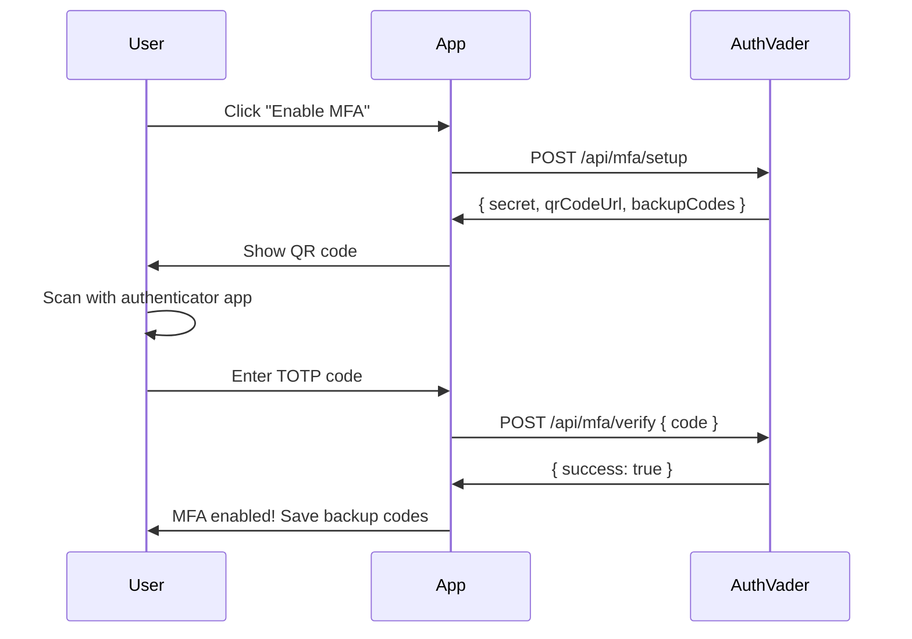
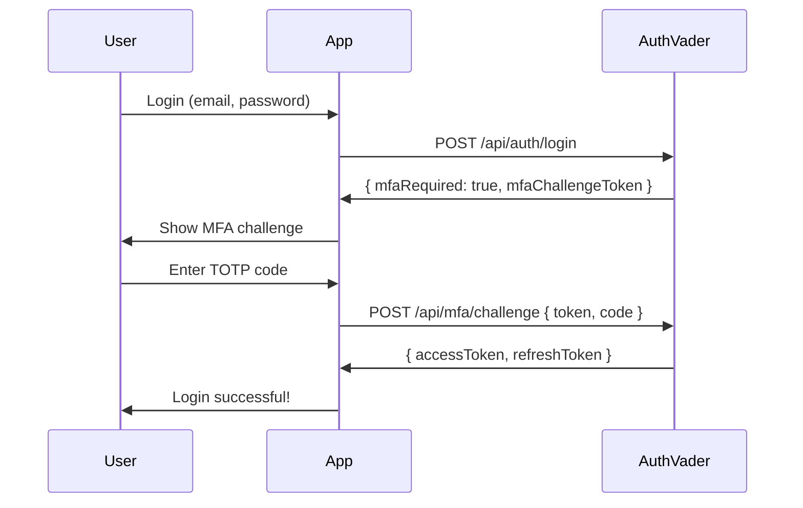

# Multi-Factor Authentication (MFA)

> Secure accounts with TOTP-based two-factor authentication.

## Overview

AuthVader supports **TOTP-based MFA** (Time-based One-Time Passwords) compatible with:
- Google Authenticator
- Authy
- 1Password
- Microsoft Authenticator
- Any TOTP-compatible app

## MFA Policies

### Instance-Level

| Setting | Description |
|---------|-------------|
| `superAdminMfaRequired` | Require MFA for all super admins |

### Tenant-Level

| Policy | Description |
|--------|-------------|
| `OPTIONAL` | MFA available but not required |
| `REQUIRED` | All members must enable MFA immediately |
| `ENFORCED_AFTER_GRACE` | Required after grace period (default: 7 days) |

## User MFA Flow

### Enabling MFA



### Authentication with MFA



## SDK Methods

### Setup MFA

```typescript
// Start MFA setup
const setup = await authvader.mfa.setup(req);
// {
//   secret: "JBSWY3DPEHPK3PXP",
//   qrCodeUrl: "data:image/png;base64,...",
//   otpauthUrl: "otpauth://totp/MyApp:user@example.com?secret=...",
//   backupCodes: ["12345678", "87654321", ...]
// }
```

### Verify MFA Setup

```typescript
// Complete MFA setup with TOTP code
const result = await authvader.mfa.verifySetup(req, {
  code: '123456', // 6-digit code from authenticator
});
// { success: true, mfaEnabled: true }
```

### Complete MFA Challenge

```typescript
// After login returns mfaRequired: true
const tokens = await authvader.mfa.verifyChallenge({
  challengeToken: 'challenge-token-from-login',
  code: '123456', // TOTP code
});
// { accessToken, refreshToken, idToken }
```

### Disable MFA

```typescript
// User must verify current code to disable
const result = await authvader.mfa.disable(req, {
  code: '123456', // Current TOTP code
});
// { success: true, mfaEnabled: false }
```

### Use Backup Code

```typescript
// When user can't access authenticator
const tokens = await authvader.mfa.useBackupCode({
  challengeToken: 'challenge-token-from-login',
  backupCode: '12345678',
});
// { accessToken, refreshToken, idToken }
// Note: Each backup code can only be used once
```

### Regenerate Backup Codes

```typescript
// Get new backup codes (invalidates old ones)
const { backupCodes } = await authvader.mfa.regenerateBackupCodes(req, {
  code: '123456', // Current TOTP code for verification
});
// backupCodes: ["new-code-1", "new-code-2", ...]
```

## React Integration

### MFA Setup Component

```tsx
import { useState } from 'react';
import { useAuthVader } from '@authvader/sdk/client';

function MfaSetup() {
  const { setupMfa, verifyMfaSetup } = useAuthVader();
  const [setup, setSetup] = useState(null);
  const [code, setCode] = useState('');
  const [backupCodes, setBackupCodes] = useState([]);

  const handleStartSetup = async () => {
    const result = await setupMfa();
    setSetup(result);
  };

  const handleVerify = async () => {
    const result = await verifyMfaSetup(code);
    if (result.success) {
      setBackupCodes(setup.backupCodes);
    }
  };

  if (backupCodes.length > 0) {
    return (
      <div>
        <h2>✅ MFA Enabled!</h2>
        <p>Save these backup codes in a safe place:</p>
        <ul>
          {backupCodes.map(code => (
            <li key={code}><code>{code}</code></li>
          ))}
        </ul>
        <p>⚠️ Each code can only be used once.</p>
      </div>
    );
  }

  if (setup) {
    return (
      <div>
        <h2>Scan QR Code</h2>
        
        <p>Or enter manually: <code>{setup.secret}</code></p>
        
        <input
          type="text"
          value={code}
          onChange={(e) => setCode(e.target.value)}
          placeholder="Enter 6-digit code"
          maxLength={6}
        />
        <button onClick={handleVerify}>Verify</button>
      </div>
    );
  }

  return (
    <div>
      <h2>Enable Two-Factor Authentication</h2>
      <p>Add an extra layer of security to your account.</p>
      <button onClick={handleStartSetup}>Set up MFA</button>
    </div>
  );
}
```

### MFA Challenge Component

```tsx
function MfaChallenge({ challengeToken, onSuccess }) {
  const { verifyMfaChallenge, useBackupCode } = useAuthVader();
  const [code, setCode] = useState('');
  const [useBackup, setUseBackup] = useState(false);
  const [error, setError] = useState('');

  const handleSubmit = async (e) => {
    e.preventDefault();
    setError('');

    try {
      if (useBackup) {
        await useBackupCode(challengeToken, code);
      } else {
        await verifyMfaChallenge(challengeToken, code);
      }
      onSuccess();
    } catch (err) {
      setError('Invalid code. Please try again.');
    }
  };

  return (
    <form onSubmit={handleSubmit}>
      <h2>Two-Factor Authentication</h2>
      
      {!useBackup ? (
        <>
          <p>Enter the 6-digit code from your authenticator app:</p>
          <input
            type="text"
            value={code}
            onChange={(e) => setCode(e.target.value)}
            placeholder="123456"
            maxLength={6}
            autoFocus
          />
        </>
      ) : (
        <>
          <p>Enter one of your backup codes:</p>
          <input
            type="text"
            value={code}
            onChange={(e) => setCode(e.target.value)}
            placeholder="12345678"
            maxLength={8}
          />
        </>
      )}
      
      {error && <p className="error">{error}</p>}
      
      <button type="submit">Verify</button>
      
      <button 
        type="button" 
        onClick={() => setUseBackup(!useBackup)}
      >
        {useBackup ? 'Use authenticator app' : 'Use backup code'}
      </button>
    </form>
  );
}
```

### Login with MFA Handling

```tsx
function Login() {
  const { login } = useAuthVader();
  const [mfaChallenge, setMfaChallenge] = useState(null);
  const navigate = useNavigate();

  const handleLogin = async (email, password) => {
    const result = await login(email, password);
    
    if (result.mfaRequired) {
      setMfaChallenge(result.mfaChallengeToken);
    } else {
      navigate('/dashboard');
    }
  };

  if (mfaChallenge) {
    return (
      <MfaChallenge 
        challengeToken={mfaChallenge}
        onSuccess={() => navigate('/dashboard')}
      />
    );
  }

  return <LoginForm onSubmit={handleLogin} />;
}
```

## Admin Configuration

### Set Tenant MFA Policy

```typescript
// Require MFA for all tenant members
await authvader.tenants.update('tenant-id', {
  mfaPolicy: 'REQUIRED',
});

// Require after grace period
await authvader.tenants.update('tenant-id', {
  mfaPolicy: 'ENFORCED_AFTER_GRACE',
  mfaGracePeriodDays: 14, // 14 days to enable MFA
});
```

### Require MFA for Super Admins

```typescript
// Instance setting
await authvader.admin.updateInstanceSettings({
  superAdminMfaRequired: true,
});
```

### Check User MFA Status

```typescript
// Get user's MFA status
const { mfaEnabled, mfaVerifiedAt } = await authvader.users.getMfaStatus(userId);

// In JWT, check mfa_enabled claim
if (!user.mfa_enabled && tenantPolicy === 'REQUIRED') {
  // Redirect to MFA setup
}
```

## Backup Codes

- **10 codes** generated during MFA setup
- Each code is **8 characters**
- **One-time use** - codes are invalidated after use
- Can be **regenerated** (invalidates all old codes)
- Stored as **bcrypt hashes** (secure even if database compromised)

### Best Practices for Users

1. **Save codes securely** - Password manager, safe, printed copy
2. **Don't store digitally** - Unless encrypted
3. **Regenerate periodically** - Especially if codes may be compromised
4. **Know where they are** - Before traveling or changing phones

## Security Considerations

### ✅ Best Practices

1. **Require MFA for admins** - Higher privilege = higher security
2. **Use grace periods wisely** - Give users time to set up
3. **Monitor MFA events** - Track setup, disable, backup code usage
4. **Provide backup code guidance** - Users often lose access

### Token Security

MFA challenge tokens:
- Short-lived (5 minutes)
- Single-use
- Tied to specific user and session
- Invalidated after successful verification

### Recovery Options

If user loses access to authenticator AND backup codes:

1. **Identity verification** - Manual process via support
2. **Admin reset** - Super admin can disable user's MFA
3. **Account recovery flow** - Verify via email + additional checks

```typescript
// Admin: Disable user's MFA (emergency only)
await authvader.admin.disableUserMfa(userId, {
  reason: 'User lost access to authenticator',
  adminId: currentAdminId,
});
```

## Webhook Events

| Event | Trigger |
|-------|--------|
| `mfa.enabled` | User enabled MFA |
| `mfa.disabled` | User disabled MFA |
| `mfa.backup_used` | Backup code was used |
| `mfa.backup_regenerated` | Backup codes regenerated |

```typescript
class MyEventHandler extends AuthVaderEventHandler {
  async onMfaEnabled(event) {
    await audit.log({
      action: 'mfa_enabled',
      userId: event.data.sub,
      timestamp: event.timestamp,
    });
  }

  async onMfaBackupUsed(event) {
    // Alert user that backup code was used
    await sendEmail(event.data.email, 'mfa-backup-used', {
      usedAt: event.timestamp,
      remainingCodes: event.data.remaining_backup_codes,
    });
  }
}
```

## Troubleshooting

### "Invalid code"

1. **Clock sync** - TOTP requires synchronized clocks (±30 seconds)
2. **Wrong account** - User may have multiple accounts in authenticator
3. **Code expired** - Codes change every 30 seconds

### "MFA required but not enabled"

User in a tenant with `REQUIRED` policy but hasn't set up MFA:
- Redirect to MFA setup flow
- Block access until MFA is enabled

### Lost Authenticator

1. Use backup code
2. If no backup codes, contact admin
3. Admin can disable MFA for account recovery

---

## Related Documentation

- [SSO Configuration](./sso.md)
- [Security Best Practices](./best-practices.md)
- [Multi-Tenancy](../concepts/multi-tenancy.md)
