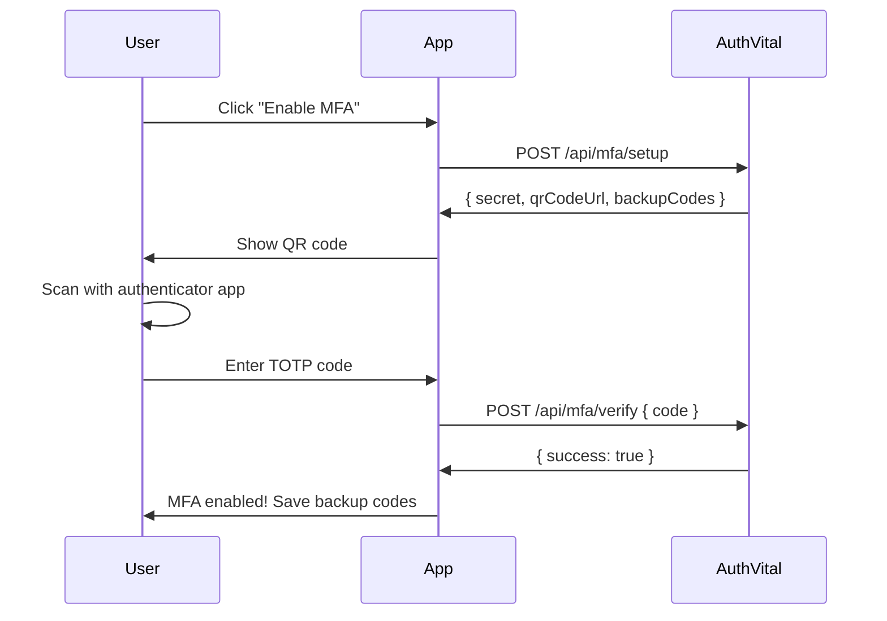
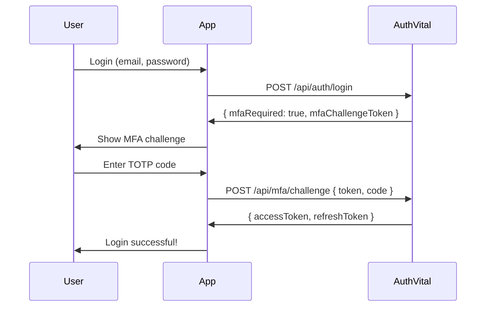

# Multi-Factor Authentication (MFA)

> Secure accounts with TOTP-based two-factor authentication.

!!! warning "Code samples: the `authvital.mfa.*` / `authvital.tenants.*` / `authvital.admin.*` API is not real"
    The MFA concepts here are accurate, but the SDK snippets use a fluent API
    that **does not exist**. MFA enrollment/verification and MFA policy
    configuration are **not** part of the Server SDK:

    - `authvital.mfa.setup / verifySetup / verifyChallenge / disable /
      useBackupCode / regenerateBackupCodes / getStatus` -> these are user-facing
      flows handled by AuthVital's hosted UI, or via the REST endpoints under
      `/api/auth/mfa/*` and `/api/mfa/*`.
    - `authvital.tenants.update(...)` (MFA policy) /
      `authvital.admin.updateInstanceSettings(...)` -> use the **AuthVital Admin
      Console**, or the REST endpoints under `/api/tenants/*` and the instance
      settings API.

    React hooks (`useAuth`) come from `@authvital/browser/react`.

## Overview

AuthVital supports **TOTP-based MFA** (Time-based One-Time Passwords) compatible with:
- Google Authenticator
- Authy
- 1Password
- Microsoft Authenticator
- Any TOTP-compatible app

## MFA Policies

### Instance-Level

| Setting | Description |
|---------|-------------|
| `superAdminMfaRequired` | Require MFA for all super admins |

### Tenant-Level

| Policy | Description |
|--------|-------------|
| `DISABLED` | MFA is disabled for the tenant |
| `OPTIONAL` | MFA available but not required |
| `ENCOURAGED` | MFA recommended, users see prompts to enable |
| `REQUIRED` | All members must enable MFA (grace period configurable via `mfaGracePeriodDays`) |

There is no separate "enforced after grace" policy value — that behavior is
`REQUIRED` with `mfaGracePeriodDays > 0`. See
[Enforcement at token mint](#enforcement-at-token-mint) for how the policy is
applied.

## Enforcement at token mint

Tenant MFA policy is enforced primarily when tokens are **minted** (authorize
and refresh), not per-request. Route-level checks (e.g. the backend's
`MfaComplianceGuard`) remain only as defense-in-depth for requests carrying
non-tenant-scoped or legacy tokens.

### Authorize-time interrupt

When a user requests a tenant-scoped token via `/oauth/authorize` and the
tenant's policy is `REQUIRED`, the user is not enrolled, and no grace window
applies, the flow is **interrupted**: the browser is redirected to the hosted
`/auth/mfa/enroll` page with a short-lived resume token. After the user
enrolls (TOTP setup + verification), the original authorize request resumes
automatically and tokens are minted. Non-browser surfaces receive a `403`
with the `interaction_required` body instead of a redirect.

### Grace-period minting (`amr` + `mfa_grace_expires_at`)

While a grace window is open (`REQUIRED` + `mfaGracePeriodDays > 0` and the
window has not elapsed), tokens are still minted, stamped with claims that
record the MFA state:

```json
{
  "sub": "user-uuid",
  "tenant_id": "tenant-uuid",
  "amr": ["pwd"],
  "mfa_grace_expires_at": 1735689600
}
```

- `amr` (RFC 8176): `["pwd"]` for password-only logins, `["pwd", "otp"]`
  when the login satisfied TOTP-based MFA.
- `mfa_grace_expires_at`: Unix seconds when the grace window closes and
  minting will be refused. Only present on tokens minted under grace.

An enrolled user's token simply carries `"amr": ["pwd", "otp"]` and no grace
claim. Grace windows anchor to the **later** of the member's join date and
the last policy change, so flipping the policy never retroactively locks
existing members out mid-window.

### Refresh-time re-check (`interaction_required`)

Every refresh re-evaluates the policy. Once the grace window has closed and
the user is still not enrolled, the token endpoint rejects the refresh:

```json
{
  "error": "interaction_required",
  "reason": "mfa_enrollment_required",
  "tenantId": "tenant-uuid",
  "requiresSetup": true
}
```

Retrying will never succeed — the session must go back through
`/oauth/authorize` (which interrupts into enrollment and resumes). The
`@authvital/server` SDK surfaces this as a typed error:

```typescript
import { InteractionRequiredError, OAuthFlow } from '@authvital/server';

try {
  const tokens = await oauth.refreshTokens(session.refreshToken);
} catch (err) {
  if (err instanceof InteractionRequiredError) {
    // err.reason === 'mfa_enrollment_required'
    // Clear the session and redirect to re-auth — do NOT retry.
    return res.redirect('/auth/login');
  }
  throw err;
}
```

### Rollout guidance for tenant admins

1. **Check the blast radius first.** `GET /api/tenants/:id/mfa-stats` returns
   `unenrolledActiveMemberCount` — the number of ACTIVE human members without
   MFA. The admin console shows this warning inline when you select
   `REQUIRED`.
2. **Set a grace period.** Prefer `REQUIRED` with `mfaGracePeriodDays` of
   7–30 days over immediate enforcement (`0`). Un-enrolled members are
   interrupted at next sign-in to enroll, but keep access until the window
   closes.
3. **Nudge before you require.** Switching to `ENCOURAGED` first prompts
   members without blocking anyone.
4. **Watch compliance.** Re-check `mfa-stats` during the grace window and
   chase stragglers before the lockout date.

## User MFA Flow

### Enabling MFA


```mermaid
sequenceDiagram
    participant U as User
    participant A as App
    participant AV as AuthVital

    U->>A: Click "Enable MFA"
    A->>AV: POST /api/mfa/setup
    AV->>A: { secret, qrCodeUrl, backupCodes }
    A->>U: Show QR code
    U->>U: Scan with authenticator app
    U->>A: Enter TOTP code
    A->>AV: POST /api/mfa/verify { code }
    AV->>A: { success: true }
    A->>U: MFA enabled! Save backup codes
```

### Authentication with MFA


```mermaid
sequenceDiagram
    participant U as User
    participant A as App
    participant AV as AuthVital

    U->>A: Login (email, password)
    A->>AV: POST /api/auth/login
    AV->>A: { mfaRequired: true, mfaChallengeToken }
    A->>U: Show MFA challenge
    U->>A: Enter TOTP code
    A->>AV: POST /api/mfa/challenge { token, code }
    AV->>A: { accessToken, refreshToken }
    A->>U: Login successful!
```

## SDK Methods

### Setup MFA

```typescript
// Start MFA setup
const setup = await authvital.mfa.setup(req);
// {
//   secret: "JBSWY3DPEHPK3PXP",
//   qrCodeUrl: "data:image/png;base64,...",
//   otpauthUrl: "otpauth://totp/MyApp:user@example.com?secret=...",
//   backupCodes: ["12345678", "87654321", ...]
// }
```

!!! info "Backup Code Lifecycle"
    **Backup codes are NOT active until MFA setup is verified.**
    
    1. `POST /mfa/setup` - Returns secret + backup codes (codes are **pending**)
    2. User scans QR code and enters TOTP code
    3. `POST /mfa/verify` - Validates TOTP code and **activates** MFA + backup codes
    4. If setup is abandoned, pending backup codes are discarded
    
    This prevents an attacker who intercepts the setup response from using backup codes
    before the legitimate user completes enrollment.

### Verify MFA Setup

```typescript
// Complete MFA setup with TOTP code
const result = await authvital.mfa.verifySetup(req, {
  code: '123456', // 6-digit code from authenticator
});
// { success: true, mfaEnabled: true }
```

### Complete MFA Challenge

```typescript
// After login returns mfaRequired: true
const tokens = await authvital.mfa.verifyChallenge({
  challengeToken: 'challenge-token-from-login',
  code: '123456', // TOTP code
});
// { accessToken, refreshToken, idToken }
```

### Disable MFA

```typescript
// User must verify current code to disable
const result = await authvital.mfa.disable(req, {
  code: '123456', // Current TOTP code
});
// { success: true, mfaEnabled: false }
```

### Use Backup Code

```typescript
// When user can't access authenticator
const tokens = await authvital.mfa.useBackupCode({
  challengeToken: 'challenge-token-from-login',
  backupCode: '12345678',
});
// { accessToken, refreshToken, idToken }
// Note: Each backup code can only be used once
```

### Regenerate Backup Codes

```typescript
// Get new backup codes (invalidates old ones)
const { backupCodes } = await authvital.mfa.regenerateBackupCodes(req, {
  code: '123456', // Current TOTP code for verification
});
// backupCodes: ["new-code-1", "new-code-2", ...]
```

## React Integration

> **Important:** MFA setup and verification are **server-side operations**. Your React 
> components should call YOUR backend API, which then uses the AuthVital server SDK.

### MFA Setup Component

```tsx
import { useState } from 'react';

// NOTE: MFA operations require server-side API calls.
// Your React component should call YOUR backend API,
// which then uses the server SDK:
//
// Server-side (your API route):
//   const result = await authvital.mfa.setup(request);
//   const verified = await authvital.mfa.verifySetup(request, { code });

function MfaSetup() {
  const [setup, setSetup] = useState(null);
  const [code, setCode] = useState('');
  const [backupCodes, setBackupCodes] = useState([]);

  const handleStartSetup = async () => {
    // Call YOUR backend API that uses the server SDK
    const response = await fetch('/api/mfa/setup', { method: 'POST' });
    const result = await response.json();
    setSetup(result);
  };

  const handleVerify = async () => {
    // Call YOUR backend API that uses the server SDK
    const response = await fetch('/api/mfa/verify', {
      method: 'POST',
      headers: { 'Content-Type': 'application/json' },
      body: JSON.stringify({ code }),
    });
    const result = await response.json();
    if (result.success) {
      setBackupCodes(setup.backupCodes);
    }
  };

  if (backupCodes.length > 0) {
    return (
      <div>
        <h2>✅ MFA Enabled!</h2>
        <p>Save these backup codes in a safe place:</p>
        <ul>
          {backupCodes.map(code => (
            <li key={code}><code>{code}</code></li>
          ))}
        </ul>
        <p>⚠️ Each code can only be used once.</p>
      </div>
    );
  }

  if (setup) {
    return (
      <div>
        <h2>Scan QR Code</h2>
        
        <p>Or enter manually: <code>{setup.secret}</code></p>
        
        <input
          type="text"
          value={code}
          onChange={(e) => setCode(e.target.value)}
          placeholder="Enter 6-digit code"
          maxLength={6}
        />
        <button onClick={handleVerify}>Verify</button>
      </div>
    );
  }

  return (
    <div>
      <h2>Enable Two-Factor Authentication</h2>
      <p>Add an extra layer of security to your account.</p>
      <button onClick={handleStartSetup}>Set up MFA</button>
    </div>
  );
}
```

### MFA Challenge Component

```tsx
// NOTE: MFA verification is a server-side operation.
// Your component should call YOUR backend API:
//
// Server-side (your API route):
//   const result = await authvital.mfa.verifyChallenge(request, { code, challengeToken });
//   const result = await authvital.mfa.useBackupCode(request, { code, challengeToken });

function MfaChallenge({ challengeToken, onSuccess }) {
  const [code, setCode] = useState('');
  const [useBackup, setUseBackup] = useState(false);
  const [error, setError] = useState('');

  const handleSubmit = async (e) => {
    e.preventDefault();
    setError('');

    try {
      // Call YOUR backend API that uses the server SDK
      const response = await fetch('/api/mfa/challenge', {
        method: 'POST',
        headers: { 'Content-Type': 'application/json' },
        body: JSON.stringify({ code, challengeToken, useBackup }),
      });
      
      if (!response.ok) throw new Error('Verification failed');
      onSuccess();
    } catch (err) {
      setError('Invalid code. Please try again.');
    }
  };

  return (
    <form onSubmit={handleSubmit}>
      <h2>Two-Factor Authentication</h2>
      
      {!useBackup ? (
        <>
          <p>Enter the 6-digit code from your authenticator app:</p>
          <input
            type="text"
            value={code}
            onChange={(e) => setCode(e.target.value)}
            placeholder="123456"
            maxLength={6}
            autoFocus
          />
        </>
      ) : (
        <>
          <p>Enter one of your backup codes:</p>
          <input
            type="text"
            value={code}
            onChange={(e) => setCode(e.target.value)}
            placeholder="12345678"
            maxLength={8}
          />
        </>
      )}
      
      {error && <p className="error">{error}</p>}
      
      <button type="submit">Verify</button>
      
      <button 
        type="button" 
        onClick={() => setUseBackup(!useBackup)}
      >
        {useBackup ? 'Use authenticator app' : 'Use backup code'}
      </button>
    </form>
  );
}
```

### Login with MFA Handling

```tsx
import { useAuth } from '@authvital/browser/react';

function Login() {
  const { login } = useAuth();
  const [mfaChallenge, setMfaChallenge] = useState(null);
  const navigate = useNavigate();

  const handleLogin = async (email, password) => {
    const result = await login(email, password);
    
    if (result.mfaRequired) {
      setMfaChallenge(result.mfaChallengeToken);
    } else {
      navigate('/dashboard');
    }
  };

  if (mfaChallenge) {
    return (
      <MfaChallenge 
        challengeToken={mfaChallenge}
        onSuccess={() => navigate('/dashboard')}
      />
    );
  }

  return <LoginForm onSubmit={handleLogin} />;
}
```

## Admin Configuration

### Set Tenant MFA Policy

```typescript
// Require MFA for all tenant members
await authvital.tenants.update('tenant-id', {
  mfaPolicy: 'REQUIRED',
});

// Require MFA with a grace period
await authvital.tenants.update('tenant-id', {
  mfaPolicy: 'REQUIRED',
  mfaGracePeriodDays: 14, // Users have 14 days to enable MFA
});
```

### Require MFA for Super Admins

```typescript
// Instance setting
await authvital.admin.updateInstanceSettings({
  superAdminMfaRequired: true,
});
```

### Check User MFA Status

```typescript
// Get MFA status for a user
const status = await authvital.mfa.getStatus(userId);
// Returns: { mfaEnabled: boolean, mfaVerifiedAt: string | null, backupCodesRemaining: number }

// In JWT, check mfa_enabled claim for quick checks
if (!user.mfa_enabled && tenantPolicy === 'REQUIRED') {
  // Redirect to MFA setup
}
```

## Backup Codes

- **10 codes** generated during MFA setup
- Each code is **8 characters**
- **One-time use** - codes are invalidated after use
- Can be **regenerated** (invalidates all old codes)
- Stored as **bcrypt hashes** (secure even if database compromised)

### Best Practices for Users

1. **Save codes securely** - Password manager, safe, printed copy
2. **Don't store digitally** - Unless encrypted
3. **Regenerate periodically** - Especially if codes may be compromised
4. **Know where they are** - Before traveling or changing phones

## Security Considerations

### ✅ Best Practices

1. **Require MFA for admins** - Higher privilege = higher security
2. **Use grace periods wisely** - Give users time to set up
3. **Monitor MFA events** - Track setup, disable, backup code usage
4. **Provide backup code guidance** - Users often lose access

### Token Security

MFA challenge tokens:
- Short-lived (5 minutes)
- Single-use
- Tied to specific user and session
- Invalidated after successful verification

### Recovery Options

If user loses access to authenticator AND backup codes:

1. **Identity verification** - Manual process via support
2. **Admin reset** - Super admin can disable user's MFA
3. **Account recovery flow** - Verify via email + additional checks

```typescript
// Admin: Disable user's MFA (emergency only)
// This operation is available via the Admin UI or direct API call.
// SDK method coming soon - for now use:

// Option 1: Admin UI
// Navigate to Users → [User] → Security → Disable MFA

// Option 2: Direct API call (requires super admin token)
await fetch(`${process.env.AV_HOST}/api/admin/users/${userId}/mfa`, {
  method: 'DELETE',
  headers: {
    'Authorization': `Bearer ${adminToken}`,
    'Content-Type': 'application/json',
  },
  body: JSON.stringify({
    reason: 'User lost access to authenticator',
  }),
});
```

## Webhook Events

!!! warning "MFA Webhook Events - Coming Soon"
    MFA-specific webhook events (`mfa.enabled`, `mfa.disabled`, `mfa.backup_used`, `mfa.backup_regenerated`) are planned but not yet implemented.
    
    For now, you can:
    
    1. **Monitor via audit logs** - Check the AuthVital admin panel for MFA events
    2. **Implement in your app** - Log MFA changes when your backend calls MFA SDK methods
    
    ```typescript
    // Example: Log MFA events in your backend
    app.post('/api/mfa/verify', async (req, res) => {
      const result = await authvital.mfa.verifySetup(req, { code: req.body.code });
      
      if (result.success) {
        // Log the MFA enablement in your own audit system
        await auditLog.create({
          action: 'mfa_enabled',
          userId: req.user.sub,
          timestamp: new Date(),
        });
      }
      
      res.json(result);
    });
    ```

## Troubleshooting

### "Invalid code"

1. **Clock sync** - TOTP requires synchronized clocks (±30 seconds)
2. **Wrong account** - User may have multiple accounts in authenticator
3. **Code expired** - Codes change every 30 seconds

### "MFA required but not enabled"

User in a tenant with `REQUIRED` policy but hasn't set up MFA:
- Redirect to MFA setup flow
- Block access until MFA is enabled

### Lost Authenticator

1. Use backup code
2. If no backup codes, contact admin
3. Admin can disable MFA for account recovery

---

## Related Documentation

- [SSO Configuration](./sso.md)
- [Security Best Practices](./best-practices/index.md)
- [Multi-Tenancy](../concepts/multi-tenancy.md)
